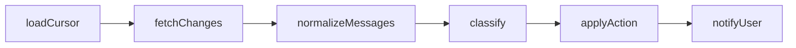

# Mail Agent (`apps/mail-agent`)

This workspace migrates the former n8n mail workflow into versioned monorepo code.

## Current Status

- Implemented: **Step 1** from `current/plan.md`
- This workspace is runnable and testable as a bootstrap scaffold.

## Usable After Step 1

### Workspace commands

- `bun run --filter mail-agent start` runs the bootstrap flow once.
- `bun run --filter mail-agent dev` runs watch mode for fast iteration.
- `bun run --filter mail-agent check-types` validates TypeScript contracts.
- `bun run --filter mail-agent lint` validates code quality.
- `bun run --filter mail-agent test` runs the smoke test suite.

### Available runtime contracts

The codebase already exposes stable module boundaries for later implementation:

- `src/config`: bootstrap config contract
- `src/data`: processed-email store contract (in-memory placeholder)
- `src/gmail`: Gmail sync boundary (`poll`) placeholder
- `src/ai`: classifier decision contract placeholder
- `src/notify`: notifier interface and noop adapter
- `src/http`: HTTP runtime placeholder contract (not enabled in step 1)
- `src/pipeline`: canonical pipeline stage contract

### Bootstrap behavior

`start` currently executes an end-to-end placeholder pipeline:

1. Build bootstrap config
2. Build placeholder adapters (data, Gmail, AI, notify, HTTP state)
3. Execute one placeholder classification decision
4. Persist one placeholder processed-email record in-memory
5. Emit one placeholder notification payload
6. Print structured runtime state to stdout

## Runtime Flow (Step 1)

```mermaid
flowchart TD
  A[main()] --> B[createBootstrapConfig]
  A --> C[createInMemoryStore]
  A --> D[createGmailSyncPlaceholder]
  A --> E[createAiPipelinePlaceholder]
  A --> F[createNoopNotifier]
  A --> G[createHttpRuntimePlaceholder]
  A --> H[createPipelineStageDescriptors]

  E --> I[classify placeholder]
  I --> J[insert placeholder processed email]
  J --> K[sendNotification placeholder]
  K --> L[poll placeholder]
  L --> M[log startup payload]
```

## Logical Pipeline Contract (Step 1)

The canonical pipeline stages are already fixed in code and validated by test:



## Quick Start

From repository root:

```bash
bun run --filter mail-agent start
```

For watch mode:

```bash
bun run --filter mail-agent dev
```

## Step 1 Verification

Run from repository root:

```bash
bun run --filter mail-agent check-types
bun run --filter mail-agent lint
bun run --filter mail-agent test
```

### Expected outcomes

- `check-types`: no TypeScript errors
- `lint`: no ESLint errors
- `test`: one passing smoke test (`pipeline scaffold exposes all planned stages`)

### Common failure cases

- Running commands outside repository root
- Missing workspace dependencies in the monorepo install state
