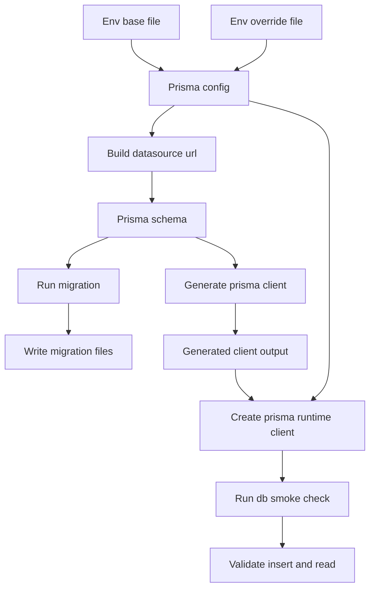
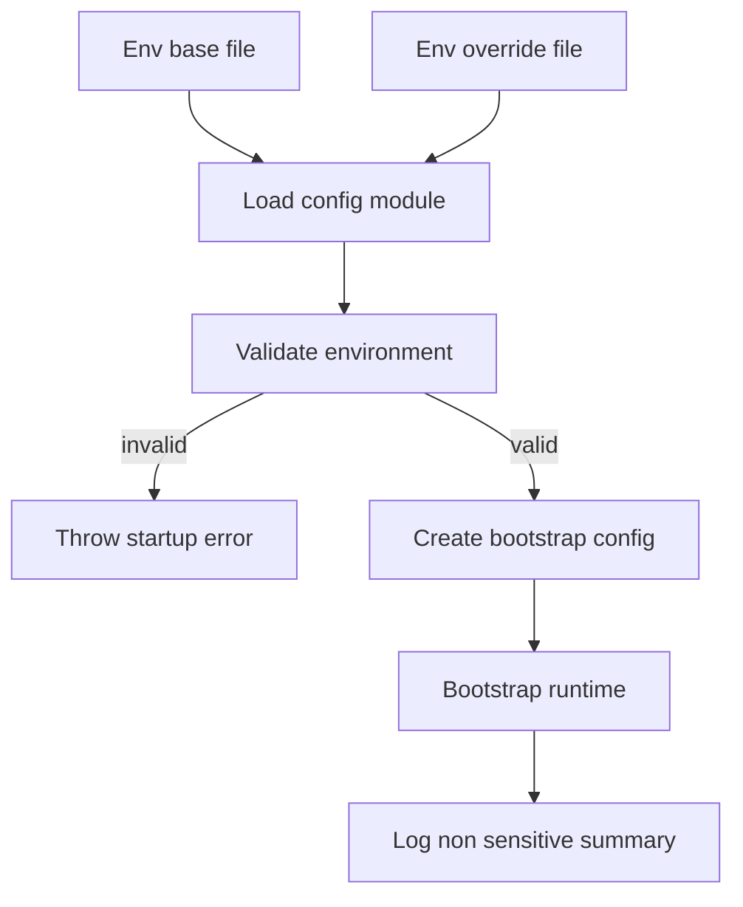
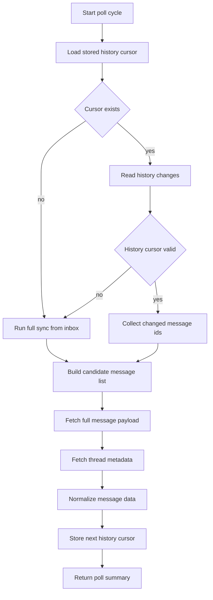
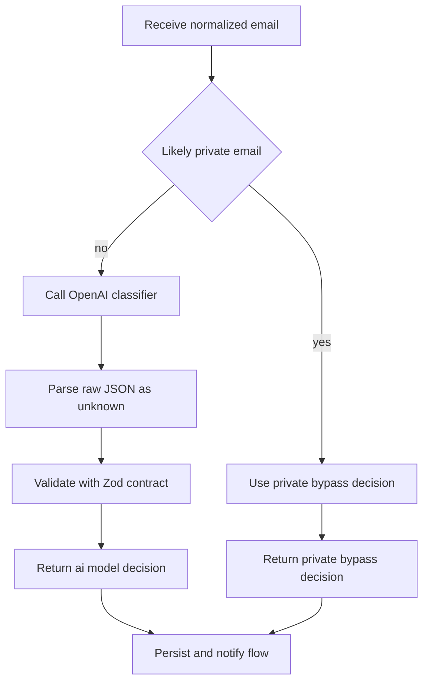
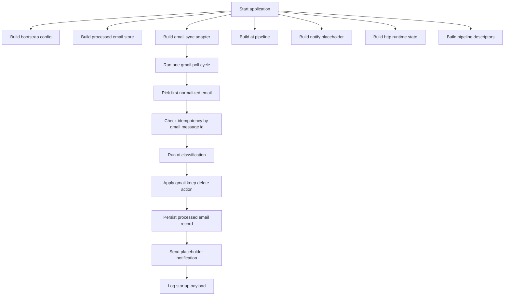
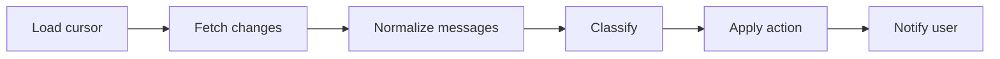

# Mail Agent (`apps/mail-agent`)

This workspace migrates the former n8n mail workflow into versioned monorepo code.

## Current Status

- Implemented: **Step 4** from `current/plan.md`
- The workspace now performs Gmail cursor polling with DB-backed state and 404 full-sync fallback.

## Usable After Step 1

### Workspace commands

- `bun run --filter mail-agent start` runs the bootstrap flow once.
- `bun run --filter mail-agent dev` runs watch mode for fast iteration.
- `bun run --filter mail-agent check-types` validates TypeScript contracts.
- `bun run --filter mail-agent lint` validates code quality.
- `bun run --filter mail-agent test` runs the smoke test suite.

### Available runtime contracts

The codebase already exposes stable module boundaries for later implementation:

- `src/config`: bootstrap config contract
- `src/data`: processed-email store contract (in-memory placeholder)
- `src/gmail`: Gmail sync module with OAuth2, cursor polling, and normalization
- `src/ai`: classifier decision contract placeholder
- `src/notify`: notifier interface and noop adapter
- `src/http`: HTTP runtime placeholder contract (not enabled in step 1)
- `src/pipeline`: canonical pipeline stage contract

## Usable After Step 2

### Prisma configuration baseline

- `prisma.config.ts` loads `.env.base` first and optional `.env` as override.
- `DATABASE_URL` is required.
- `DATABASE_SCHEMA_NAME` is required and must equal `mail`.
- Prisma datasource URL is built as `${DATABASE_URL}?schema=${DATABASE_SCHEMA_NAME}`.

### Database schema and migration state

- `prisma/schema.prisma` defines:
  - `processed_emails`
  - `agent_state`
- Initial migration is present in `prisma/migrations/`.
- Prisma client output is generated under `src/generated/prisma`.

### Prisma runtime access

- `src/data/prisma.ts` exposes a Prisma client with `@prisma/adapter-pg`.
- Adapter schema binding uses `DATABASE_SCHEMA_NAME` from `prisma.config.ts`.
- `src/data/prisma-smoke.ts` performs an insert/read smoke check for both tables.

## Usable After Step 3

### Fail-fast runtime configuration

- `src/config/index.ts` loads `.env.base` first, then optional `.env` override.
- Startup validates env with Zod and throws a clear error on the first boot when values are missing or invalid.
- `DATABASE_SCHEMA_NAME` is strictly validated as `mail`.
- Parsed config is exposed through `createBootstrapConfig()` for all runtime modules.

### Runtime bootstrap wiring

- `src/index.ts` now uses validated config values in the startup payload.
- Runtime logs include only non-sensitive configuration summary (schema, labels, poll interval, telegram parse mode).
- Secret values (API keys, client secrets, tokens) are never logged.

### Required environment variables

- `DATABASE_URL`
- `DATABASE_SCHEMA_NAME` (`mail`)
- `MAIL_AGENT_OPENAI_API_KEY` (required for non-private AI model path)
- `MAIL_AGENT_OPENAI_MODEL` (required for non-private AI model path)
- `MAIL_AGENT_PUBLIC_BASE_URL`
- `MAIL_AGENT_GMAIL_CLIENT_ID`
- `MAIL_AGENT_GMAIL_CLIENT_SECRET`
- `MAIL_AGENT_GMAIL_REFRESH_TOKEN`
- `MAIL_AGENT_POLL_INTERVAL_MS`
- `MAIL_AGENT_LABEL_AI_MANAGED`
- `MAIL_AGENT_LABEL_KEEP`
- `MAIL_AGENT_LABEL_DELETE`
- `MAIL_AGENT_TELEGRAM_BOT_TOKEN` (required once real notifier is enabled)
- `MAIL_AGENT_TELEGRAM_CHAT_ID` (required once real notifier is enabled)
- `MAIL_AGENT_TELEGRAM_ALLOWED_USER_IDS` (optional)
- `MAIL_AGENT_TELEGRAM_PARSE_MODE`

## Prisma Flow (Step 2)



## Config Bootstrap Flow (Step 3)



## Usable After Step 4

### Gmail OAuth2 + API client wiring

- `src/gmail/index.ts` creates a Gmail API client with OAuth2 refresh-token auth.
- Required scopes are configured for `gmail.modify` and `gmail.labels`.

### Cursor-based polling with persistence

- Poll reads `agent_state.gmail_history_id` as incremental cursor.
- If cursor exists, sync uses `users.history.list(startHistoryId=...)`.
- Updated cursor is persisted back to `agent_state` after successful polling.

### Full-sync fallback

- If Gmail history call fails with invalid/expired cursor (`404`), sync switches to full sync.
- Full sync loads current mailbox messages (`users.messages.list`) and profile cursor (`users.getProfile`).
- New cursor is persisted so later runs return to incremental history polling.

### Message + thread normalization helpers

- Each candidate message is fetched with `users.messages.get(format=full)`.
- Thread context is fetched with `users.threads.get(format=metadata)`.
- Normalized payload includes sender/recipients, subject, labels, text body, reduced HTML body, thread participants, and timestamps.

## Gmail Sync Flow (Step 4)



## Usable After Step 5

### AI classification paths

- `src/ai/index.ts` now provides real classification routing with two paths:
  - `private_bypass`: likely private emails skip model classification and are always kept
  - `ai_model`: non-private emails are classified by OpenAI
- Classifier system prompt stays in German and follows the extracted n8n prompt structure (`Rolle`, `Aufgabe`, `Behalten oder Löschen`, `Zusammenfassung`, `Ausgabe`) as closely as possible.
- Classifier output contract is enforced via Zod with strict fields:
  - `deleteIt`
  - `summary`
  - `subject`
  - `reason`

### Non-private model classification

- Non-private emails call OpenAI with `MAIL_AGENT_OPENAI_MODEL`.
- Model output is treated as untrusted JSON and parsed as `unknown` before Zod validation.
- Invalid or malformed model output throws a clear parsing error.

### Temporary AI smoke test

- `bun run --filter mail-agent ai:smoke` executes:
  - one private sample (must bypass AI)
  - one non-private sample (must use model path or return clear config/model error)
  - one malformed output parse check (must throw validation error)

## AI Decision Flow (Step 5)



### Bootstrap behavior

`start` currently executes an end-to-end bootstrap flow:

1. Build bootstrap config
2. Build adapters (processed-email store, Gmail sync, AI pipeline, notify placeholder, HTTP state)
3. Execute one Gmail sync poll run (`history` or `full_sync`)
4. Pick first normalized mail and run idempotency check by `gmailMessageId`
5. Classify mail (`private_bypass` or `ai_model`)
6. Apply Gmail action (`keep` or `delete`) with configured labels
7. Persist processing result to `processed_emails`
8. Emit one placeholder notification payload when classification, action, and persistence succeed
9. Print structured runtime state to stdout (including Gmail, AI, action, and idempotency summary)

## Runtime Flow (Step 1)



## Logical Pipeline Contract (Step 1)

The canonical pipeline stages are already fixed in code and validated by test:



## Quick Start

From repository root:

```bash
bun run --filter mail-agent start
```

For watch mode:

```bash
bun run --filter mail-agent dev
```

Configure local secrets by copying template values into `.env`:

```bash
cp apps/mail-agent/.env.example apps/mail-agent/.env
```

---

## Step 4

### GCP setup — detailed guide

#### 1. Create a Google Cloud project

1. Open [Google Cloud Console](https://console.cloud.google.com/).
2. Click the project dropdown in the top-left header.
3. Click **"New Project"**.
4. Enter a project name (for example, "Gmail Local Reader").
5. Organization can stay empty for private usage.
6. Click **"Create"** and switch to the new project.

#### 2. Enable Gmail API

1. Open **APIs & Services -> Library** or [API Library](https://console.cloud.google.com/apis/library).
2. Search for **"Gmail API"**.
3. Select **"Gmail API"** from results.
4. Click **"Enable"**.

#### 3. Configure OAuth consent screen

1. Open **Google Auth Platform -> Branding** or [OAuth Consent Screen](https://console.cloud.google.com/auth/branding).
   - If not configured yet, click **"Get Started"**.

2. **App information**:
   - **App name**: for example, "Gmail Local Reader". Google validates this and it should look like a real app name. See [naming examples](https://support.google.com/cloud/answer/15549049?visit_id=639117854563019737-2224445486&rd=1#app-name&zippy=%2Capp-name).
   - **User support email**: select your email.

3. **Audience**:
   - **User type**: **"External"** (required for `@gmail.com` accounts).

4. **Contact information**:
   - Add your developer notification email.

5. **Finish**:
   - Accept the Google API Services User Data Policy.
   - Click **"Create"**.

##### Add scopes

1. Open **Google Auth Platform -> Data Access**.
2. Click **"Add or Remove Scopes"**.
3. Add these scopes:
   - `https://www.googleapis.com/auth/gmail.modify` (restricted)
   - `https://www.googleapis.com/auth/gmail.labels` (non-sensitive)
4. Click **"Update"** and **"Save"**.

> [!info] `gmail.modify` is classified as **restricted**. For personal-use apps (up to 100 users), the personal-use exception applies and CASA verification is not required. `gmail.labels` is non-sensitive.

##### Add test users

1. Open **Google Auth Platform -> Audience**.
2. In **"Test users"**, click **"Add users"**.
3. Add your Gmail address (the mailbox you want to read).
4. Save.

> [!warning] In testing mode, only configured test users can complete the consent flow.

##### Set publishing status to production

1. Open **Google Auth Platform -> Audience**.
2. Find **"Publishing status"** and click **"Publish App"**.
3. Confirm.

> [!warning] Critical: in testing mode, refresh tokens can expire after about 7 days. After switching to production, create new OAuth credentials and complete consent again; old testing-mode refresh tokens keep their original expiration behavior.

4. You can ignore the review submission message for this personal-use setup.

#### 4. Create OAuth client credentials

1. Open **Google Auth Platform -> Clients** or [Credentials Page](https://console.cloud.google.com/auth/clients).
2. Click **"+ Create Client"**.
3. Choose **"Desktop app"** as application type.
4. Enter a name (for example, "Gmail Local Reader Desktop" or `app-mail`).
5. Click **"Create"**.
6. Copy or download credentials immediately:
   - download the JSON credentials file
   - client secret is fully visible only at creation time
7. Store values in `MAIL_AGENT_GMAIL_CLIENT_ID` and `MAIL_AGENT_GMAIL_CLIENT_SECRET`.

> [!tip] Why use a desktop app instead of web application?
> For desktop app clients, you do not need to manually configure redirect URIs. Google automatically allows loopback addresses (`http://127.0.0.1`, `http://[::1]`, `http://localhost`) on any port. With web application clients, localhost redirect URIs must be configured manually.

### 5) Generate one refresh token

Run one OAuth consent flow and store the returned refresh token.

From repository root:

```bash
bun run --filter mail-agent gmail:auth
```

Behavior of this CLI:

- starts a local callback server on `http://127.0.0.1:3000`
- prints the OAuth consent URL in terminal
- opens the URL automatically on macOS
- prints `MAIL_AGENT_GMAIL_REFRESH_TOKEN="..."` after successful consent

### 6) Fill `apps/mail-agent/.env`

At minimum, set all required values in your `.env`:

```env
MAIL_AGENT_GMAIL_CLIENT_ID="..."
MAIL_AGENT_GMAIL_CLIENT_SECRET="..."
MAIL_AGENT_GMAIL_REFRESH_TOKEN="..."
```

For Step 4 Gmail testing, OpenAI and Telegram secrets can stay empty because those integrations are still placeholders in this stage.

### 7) Initialize DB schema (empty DB)

From repository root:

```bash
bun run --filter mail-agent prisma generate
bun run --filter mail-agent prisma migrate dev --name init
```

If you want to reset smoke artifacts before Gmail tests:

```bash
bun run --filter mail-agent smoke:clean
```

What this resets:

- removes smoke test rows from `processed_emails`
- removes `agent_state` row for `mail-agent-state` (forces next run into full sync)

### 8) Start and validate first Gmail run

From repository root:

```bash
bun run --filter mail-agent start
```

Expected on first run with empty `agent_state`:

- `gmailSync.mode` is `full_sync`
- `gmailSync.cursorAfter` is populated
- `agent_state.gmail_history_id` is stored in DB

Expected on subsequent runs:

- `gmailSync.mode` is usually `history`
- `cursorBefore` and `cursorAfter` reflect incremental sync

### 9) Temporary Gmail read smoke output

Use this temporary command to perform a direct Gmail read (`messages.list` + `messages.get`) and print a mailbox preview:

```bash
bun run --filter mail-agent gmail:smoke
```

Expected outcome:

- JSON output contains `listedMessageCount`, `previewCount`, and `preview`
- `preview` rows include real `sender`, `subject`, `date`, and `labels` values from your mailbox
- this smoke command is temporary and will be removed in the final cleanup step from `current/plan.md`

## Database Setup (Step 2)

From repository root:

```bash
bun run --filter mail-agent prisma generate
bun run --filter mail-agent prisma migrate dev --name init
```

Run DB smoke test:

```bash
bun run --filter mail-agent db:smoke
```

## Step 1 Verification

Run from repository root:

```bash
bun run --filter mail-agent check-types
bun run --filter mail-agent lint
bun run --filter mail-agent test
```

### Expected outcomes

- `check-types`: no TypeScript errors
- `lint`: no ESLint errors
- `test`: one passing smoke test (`pipeline scaffold exposes all planned stages`)

## Step 2 Verification

Run from repository root:

```bash
bun run --filter mail-agent prisma generate
bun run --filter mail-agent prisma migrate dev --name init
bun run --filter mail-agent db:smoke
```

### Expected outcomes

- `prisma generate`: client generated at `src/generated/prisma`
- `prisma migrate dev`: migration directory exists and DB is in sync
- `db:smoke`: JSON output contains non-null `state` and `latestProcessedEmail`

## Step 3 Verification

### Missing core env should fail fast

From repository root:

```bash
MAIL_AGENT_GMAIL_CLIENT_ID= bun run --filter mail-agent start
```

Expected outcome:

- process exits with `Invalid mail-agent environment configuration`

### Full env should start cleanly

From repository root:

```bash
bun run --filter mail-agent start
```

Expected outcome:

- process prints bootstrap JSON including `databaseSchemaName`, `pollIntervalMs`, `labels`, `telegram.parseMode`, and `gmailSync`

## Step 4 Verification

### Poll with valid mailbox

From repository root:

```bash
bun run --filter mail-agent start
```

Expected outcome:

- startup JSON includes `gmailSync.mode`, `gmailSync.cursorBefore`, `gmailSync.cursorAfter`, and candidate/normalized message counts

### Verify persisted cursor

Check `agent_state.gmail_history_id` in your local DB after one successful run.

Expected outcome:

- cursor value is present and changes across subsequent poll cycles

### Simulate invalid cursor fallback

Set an outdated `gmail_history_id` in DB and run `start` again.

Expected outcome:

- poll switches to `gmailSync.mode = full_sync` and stores a new valid cursor

## Step 5 Verification

### Run AI smoke test

From repository root:

```bash
bun run --filter mail-agent ai:smoke
```

Expected outcome:

- `privateSample.path` equals `private_bypass`
- `nonPrivateSample.path` equals `ai_model` when OpenAI env is set
- `nonPrivateError` is a clear config error when OpenAI env is not set
- `malformedModelOutputError` contains an invalid classifier output error

### Run bootstrap with AI summary output

From repository root:

```bash
bun run --filter mail-agent start
```

Expected outcome:

- startup JSON includes `aiClassification.path` when a message is classified
- startup JSON includes `aiClassificationError` when non-private classification cannot run

## Step 6 Verification

### Trace pipeline with debug logging

From repository root:

```bash
DEBUG=app:* bun run --filter mail-agent start
```

Useful namespace filters:

- `DEBUG=app:action:*` for pipeline/action flow
- `DEBUG=app:db:*` for persistence and cursor state operations

Expected debug flow signals:

- `app:action:pollGmail` shows cursor loading, history/full-sync mode, and message counts
- `app:action:main` shows selected message, idempotency decision, classification/action/persistence result
- `app:action:classifyEmail` shows private bypass vs model path and OpenAI output status
- `app:action:applyGmailAction` shows applied action and label mutation counts
- `app:db:hasProcessedMessage` / `app:db:insertProcessedEmail` show idempotency and DB writes

### Verify idempotency guard

Run `start` twice with the same candidate message still present.

Expected outcome:

- second pass sets `idempotencySkipped: true` in startup output
- no duplicate row is inserted for the same `gmail_message_id`

### Verify Gmail action mapping

Expected action behavior:

- when `deleteIt = true`: add `aiManaged` + `delete` labels, remove `INBOX` and `keep` label
- when `deleteIt = false`: add `aiManaged` + `keep` labels, remove `delete` label

### Verify persistence in `processed_emails`

After a successful run (classification + action + persistence):

- one row exists in `processed_emails` with `gmail_message_id`
- row contains `delete_it`, `applied_action`, and `classifier_output`
- startup JSON shows `actionResult` and `persistenceError: null`

### Common failure cases

- Running commands outside repository root
- Missing workspace dependencies in the monorepo install state
