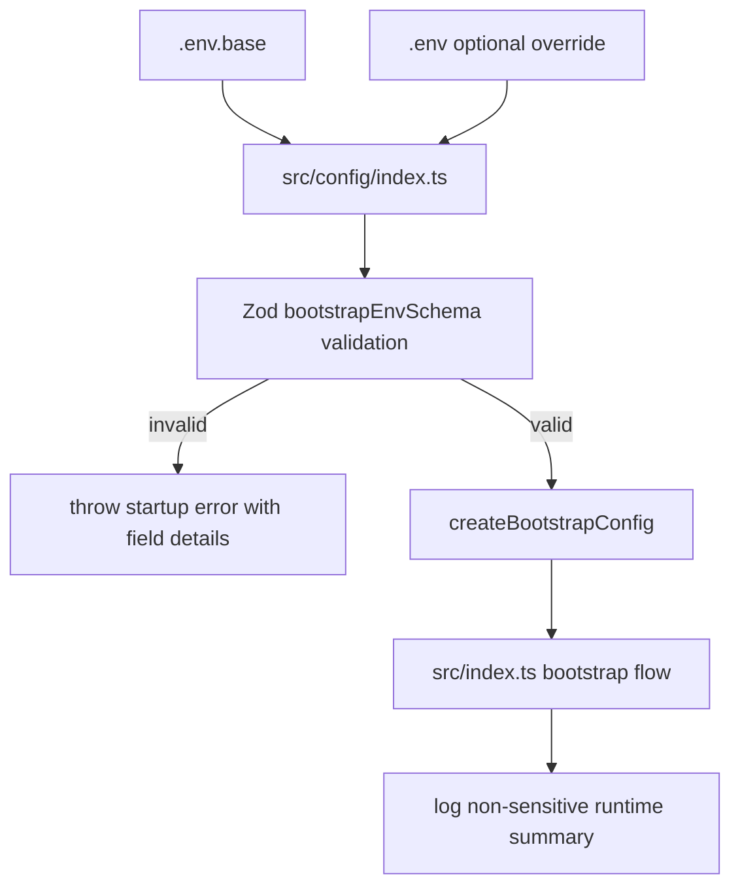
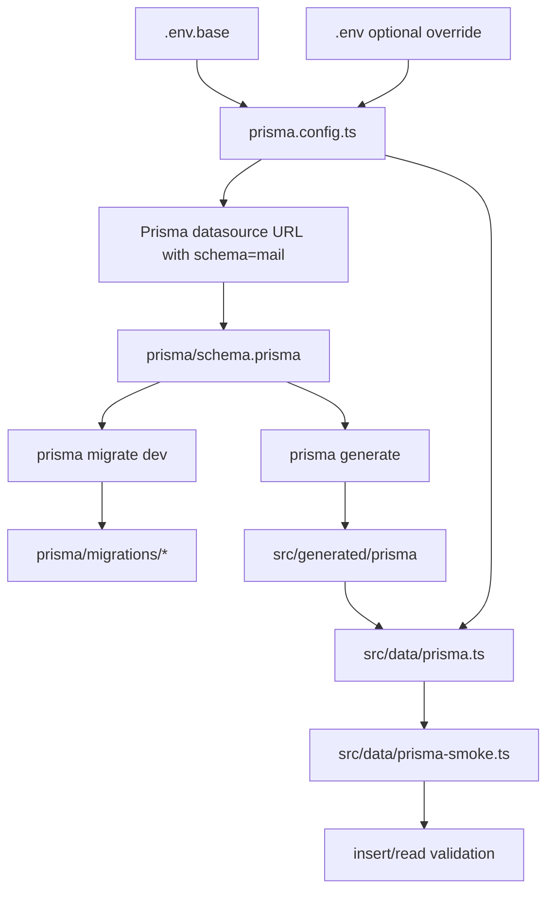
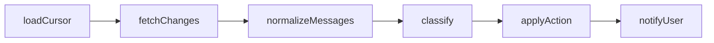

# Mail Agent (`apps/mail-agent`)

This workspace migrates the former n8n mail workflow into versioned monorepo code.

## Current Status

- Implemented: **Step 3** from `current/plan.md`
- The workspace now fails fast on missing/invalid runtime configuration.

## Usable After Step 1

### Workspace commands

- `bun run --filter mail-agent start` runs the bootstrap flow once.
- `bun run --filter mail-agent dev` runs watch mode for fast iteration.
- `bun run --filter mail-agent check-types` validates TypeScript contracts.
- `bun run --filter mail-agent lint` validates code quality.
- `bun run --filter mail-agent test` runs the smoke test suite.

### Available runtime contracts

The codebase already exposes stable module boundaries for later implementation:

- `src/config`: bootstrap config contract
- `src/data`: processed-email store contract (in-memory placeholder)
- `src/gmail`: Gmail sync boundary (`poll`) placeholder
- `src/ai`: classifier decision contract placeholder
- `src/notify`: notifier interface and noop adapter
- `src/http`: HTTP runtime placeholder contract (not enabled in step 1)
- `src/pipeline`: canonical pipeline stage contract

## Usable After Step 2

### Prisma configuration baseline

- `prisma.config.ts` loads `.env.base` first and optional `.env` as override.
- `DATABASE_URL` is required.
- `DATABASE_SCHEMA_NAME` is required and must equal `mail`.
- Prisma datasource URL is built as `${DATABASE_URL}?schema=${DATABASE_SCHEMA_NAME}`.

### Database schema and migration state

- `prisma/schema.prisma` defines:
  - `processed_emails`
  - `agent_state`
- Initial migration is present in `prisma/migrations/`.
- Prisma client output is generated under `src/generated/prisma`.

### Prisma runtime access

- `src/data/prisma.ts` exposes a Prisma client with `@prisma/adapter-pg`.
- Adapter schema binding uses `DATABASE_SCHEMA_NAME` from `prisma.config.ts`.
- `src/data/prisma-smoke.ts` performs an insert/read smoke check for both tables.

## Usable After Step 3

### Fail-fast runtime configuration

- `src/config/index.ts` loads `.env.base` first, then optional `.env` override.
- Startup validates env with Zod and throws a clear error on the first boot when values are missing or invalid.
- `DATABASE_SCHEMA_NAME` is strictly validated as `mail`.
- Parsed config is exposed through `createBootstrapConfig()` for all runtime modules.

### Runtime bootstrap wiring

- `src/index.ts` now uses validated config values in the startup payload.
- Runtime logs include only non-sensitive configuration summary (schema, labels, poll interval, telegram parse mode).
- Secret values (API keys, client secrets, tokens) are never logged.

### Required environment variables

- `DATABASE_URL`
- `DATABASE_SCHEMA_NAME` (`mail`)
- `MAIL_AGENT_OPENAI_API_KEY`
- `MAIL_AGENT_OPENAI_MODEL`
- `MAIL_AGENT_PUBLIC_BASE_URL`
- `MAIL_AGENT_GMAIL_CLIENT_ID`
- `MAIL_AGENT_GMAIL_CLIENT_SECRET`
- `MAIL_AGENT_GMAIL_REFRESH_TOKEN`
- `MAIL_AGENT_POLL_INTERVAL_MS`
- `MAIL_AGENT_LABEL_AI_MANAGED`
- `MAIL_AGENT_LABEL_KEEP`
- `MAIL_AGENT_LABEL_DELETE`
- `MAIL_AGENT_TELEGRAM_BOT_TOKEN`
- `MAIL_AGENT_TELEGRAM_CHAT_ID`
- `MAIL_AGENT_TELEGRAM_ALLOWED_USER_IDS` (optional)
- `MAIL_AGENT_TELEGRAM_PARSE_MODE`

## Config Bootstrap Flow (Step 3)



## Prisma Flow (Step 2)



### Bootstrap behavior

`start` currently executes an end-to-end placeholder pipeline:

1. Build bootstrap config
2. Build placeholder adapters (data, Gmail, AI, notify, HTTP state)
3. Execute one placeholder classification decision
4. Persist one placeholder processed-email record in-memory
5. Emit one placeholder notification payload
6. Print structured runtime state to stdout

## Runtime Flow (Step 1)

```mermaid
flowchart TD
  A[main()] --> B[createBootstrapConfig]
  A --> C[createInMemoryStore]
  A --> D[createGmailSyncPlaceholder]
  A --> E[createAiPipelinePlaceholder]
  A --> F[createNoopNotifier]
  A --> G[createHttpRuntimePlaceholder]
  A --> H[createPipelineStageDescriptors]

  E --> I[classify placeholder]
  I --> J[insert placeholder processed email]
  J --> K[sendNotification placeholder]
  K --> L[poll placeholder]
  L --> M[log startup payload]
```

## Logical Pipeline Contract (Step 1)

The canonical pipeline stages are already fixed in code and validated by test:



## Quick Start

From repository root:

```bash
bun run --filter mail-agent start
```

For watch mode:

```bash
bun run --filter mail-agent dev
```

Configure local secrets by copying template values into `.env`:

```bash
cp apps/mail-agent/.env.example apps/mail-agent/.env
```

## Database Setup (Step 2)

From repository root:

```bash
bun run --filter mail-agent prisma generate
bun run --filter mail-agent prisma migrate dev --name init
```

Run DB smoke test:

```bash
bun run --filter mail-agent db:smoke
```

## Step 1 Verification

Run from repository root:

```bash
bun run --filter mail-agent check-types
bun run --filter mail-agent lint
bun run --filter mail-agent test
```

### Expected outcomes

- `check-types`: no TypeScript errors
- `lint`: no ESLint errors
- `test`: one passing smoke test (`pipeline scaffold exposes all planned stages`)

## Step 2 Verification

Run from repository root:

```bash
bun run --filter mail-agent prisma generate
bun run --filter mail-agent prisma migrate dev --name init
bun run --filter mail-agent db:smoke
```

### Expected outcomes

- `prisma generate`: client generated at `src/generated/prisma`
- `prisma migrate dev`: migration directory exists and DB is in sync
- `db:smoke`: JSON output contains non-null `state` and `latestProcessedEmail`

## Step 3 Verification

### Missing env should fail fast

From repository root:

```bash
MAIL_AGENT_OPENAI_API_KEY= bun run --filter mail-agent start
```

Expected outcome:

- process exits with `Invalid mail-agent environment configuration`

### Full env should start cleanly

From repository root:

```bash
bun run --filter mail-agent start
```

Expected outcome:

- process prints bootstrap JSON including `databaseSchemaName`, `pollIntervalMs`, `labels`, and `telegram.parseMode`

### Common failure cases

- Running commands outside repository root
- Missing workspace dependencies in the monorepo install state
