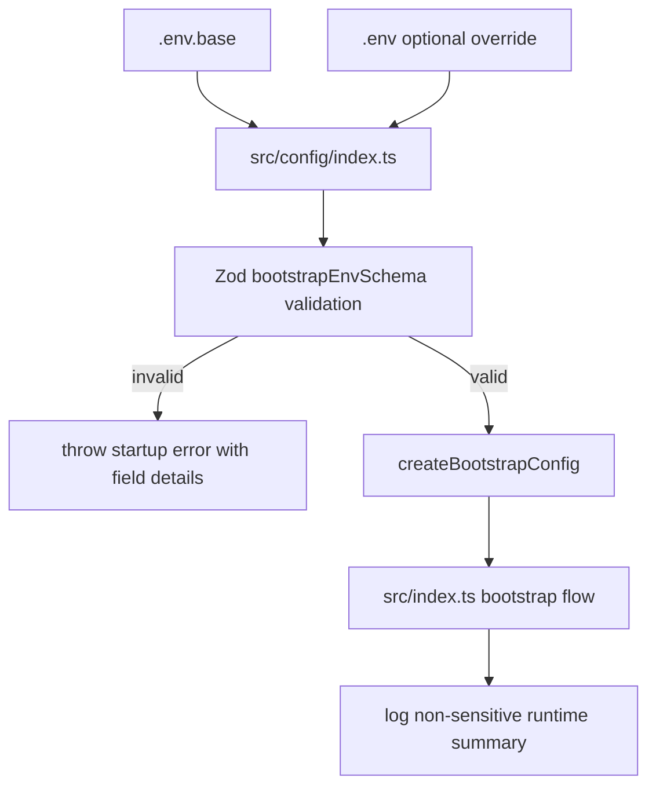
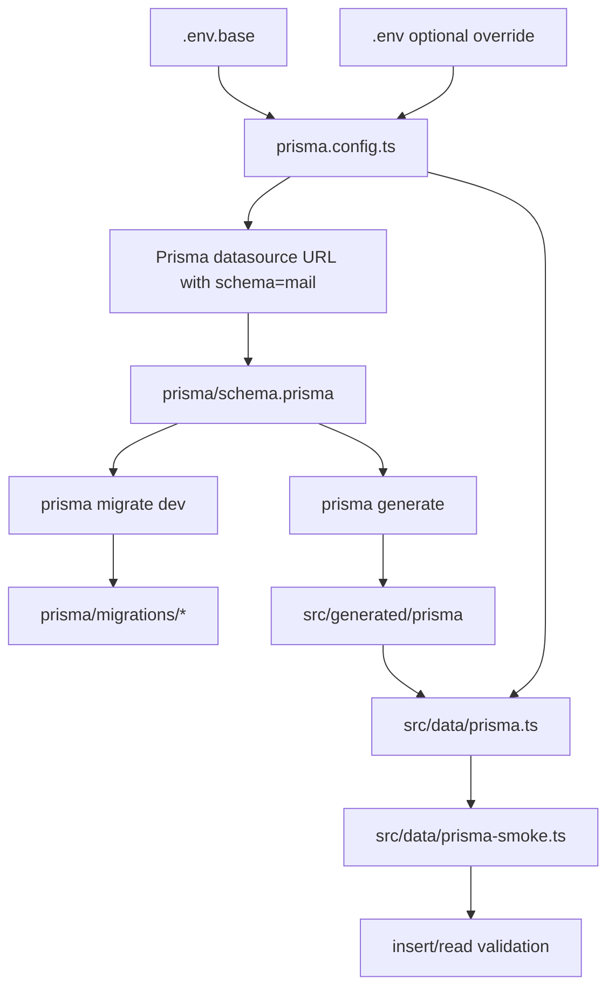
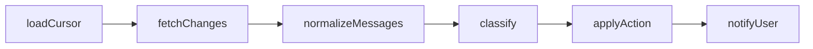

# Mail Agent (`apps/mail-agent`)

This workspace migrates the former n8n mail workflow into versioned monorepo code.

## Current Status

- Implemented: **Step 4** from `current/plan.md`
- The workspace now performs Gmail cursor polling with DB-backed state and 404 full-sync fallback.

## Usable After Step 1

### Workspace commands

- `bun run --filter mail-agent start` runs the bootstrap flow once.
- `bun run --filter mail-agent dev` runs watch mode for fast iteration.
- `bun run --filter mail-agent check-types` validates TypeScript contracts.
- `bun run --filter mail-agent lint` validates code quality.
- `bun run --filter mail-agent test` runs the smoke test suite.

### Available runtime contracts

The codebase already exposes stable module boundaries for later implementation:

- `src/config`: bootstrap config contract
- `src/data`: processed-email store contract (in-memory placeholder)
- `src/gmail`: Gmail sync module with OAuth2, cursor polling, and normalization
- `src/ai`: classifier decision contract placeholder
- `src/notify`: notifier interface and noop adapter
- `src/http`: HTTP runtime placeholder contract (not enabled in step 1)
- `src/pipeline`: canonical pipeline stage contract

## Usable After Step 4

### Gmail OAuth2 + API client wiring

- `src/gmail/index.ts` creates a Gmail API client with OAuth2 refresh-token auth.
- Required scopes are configured for `gmail.modify` and `gmail.labels`.

### Cursor-based polling with persistence

- Poll reads `agent_state.gmail_history_id` as incremental cursor.
- If cursor exists, sync uses `users.history.list(startHistoryId=...)`.
- Updated cursor is persisted back to `agent_state` after successful polling.

### Full-sync fallback

- If Gmail history call fails with invalid/expired cursor (`404`), sync switches to full sync.
- Full sync loads current mailbox messages (`users.messages.list`) and profile cursor (`users.getProfile`).
- New cursor is persisted so later runs return to incremental history polling.

### Message + thread normalization helpers

- Each candidate message is fetched with `users.messages.get(format=full)`.
- Thread context is fetched with `users.threads.get(format=metadata)`.
- Normalized payload includes sender/recipients, subject, labels, text body, reduced HTML body, thread participants, and timestamps.

## Gmail Sync Flow (Step 4)

```mermaid
flowchart TD
  A[poll()] --> B[load cursor from agent_state]
  B --> C{cursor exists?}
  C -->|no| D[full sync via users.messages.list]
  C -->|yes| E[users.history.list startHistoryId]
  E --> F{404 invalid history?}
  F -->|yes| D
  F -->|no| G[extract candidate message IDs]
  D --> H[fetch candidate messages]
  G --> H
  H --> I[users.messages.get full]
  I --> J[users.threads.get metadata]
  J --> K[normalize payloads]
  K --> L[persist new gmail_history_id]
  L --> M[return poll summary]
```

## Usable After Step 2

### Prisma configuration baseline

- `prisma.config.ts` loads `.env.base` first and optional `.env` as override.
- `DATABASE_URL` is required.
- `DATABASE_SCHEMA_NAME` is required and must equal `mail`.
- Prisma datasource URL is built as `${DATABASE_URL}?schema=${DATABASE_SCHEMA_NAME}`.

### Database schema and migration state

- `prisma/schema.prisma` defines:
  - `processed_emails`
  - `agent_state`
- Initial migration is present in `prisma/migrations/`.
- Prisma client output is generated under `src/generated/prisma`.

### Prisma runtime access

- `src/data/prisma.ts` exposes a Prisma client with `@prisma/adapter-pg`.
- Adapter schema binding uses `DATABASE_SCHEMA_NAME` from `prisma.config.ts`.
- `src/data/prisma-smoke.ts` performs an insert/read smoke check for both tables.

## Usable After Step 3

### Fail-fast runtime configuration

- `src/config/index.ts` loads `.env.base` first, then optional `.env` override.
- Startup validates env with Zod and throws a clear error on the first boot when values are missing or invalid.
- `DATABASE_SCHEMA_NAME` is strictly validated as `mail`.
- Parsed config is exposed through `createBootstrapConfig()` for all runtime modules.

### Runtime bootstrap wiring

- `src/index.ts` now uses validated config values in the startup payload.
- Runtime logs include only non-sensitive configuration summary (schema, labels, poll interval, telegram parse mode).
- Secret values (API keys, client secrets, tokens) are never logged.

### Required environment variables

- `DATABASE_URL`
- `DATABASE_SCHEMA_NAME` (`mail`)
- `MAIL_AGENT_OPENAI_API_KEY`
- `MAIL_AGENT_OPENAI_MODEL`
- `MAIL_AGENT_PUBLIC_BASE_URL`
- `MAIL_AGENT_GMAIL_CLIENT_ID`
- `MAIL_AGENT_GMAIL_CLIENT_SECRET`
- `MAIL_AGENT_GMAIL_REFRESH_TOKEN`
- `MAIL_AGENT_POLL_INTERVAL_MS`
- `MAIL_AGENT_LABEL_AI_MANAGED`
- `MAIL_AGENT_LABEL_KEEP`
- `MAIL_AGENT_LABEL_DELETE`
- `MAIL_AGENT_TELEGRAM_BOT_TOKEN`
- `MAIL_AGENT_TELEGRAM_CHAT_ID`
- `MAIL_AGENT_TELEGRAM_ALLOWED_USER_IDS` (optional)
- `MAIL_AGENT_TELEGRAM_PARSE_MODE`

## Config Bootstrap Flow (Step 3)



## Prisma Flow (Step 2)



### Bootstrap behavior

`start` currently executes an end-to-end scaffold flow:

1. Build bootstrap config
2. Build adapters (data, Gmail sync, AI placeholder, notify placeholder, HTTP state)
3. Execute one placeholder classification decision
4. Persist one placeholder processed-email record in-memory
5. Emit one placeholder notification payload
6. Execute one Gmail sync poll run (`history` or `full_sync`)
7. Print structured runtime state to stdout (including Gmail poll summary)

## Runtime Flow (Step 1)

```mermaid
flowchart TD
  A[main()] --> B[createBootstrapConfig]
  A --> C[createInMemoryStore]
  A --> D[createGmailSync]
  A --> E[createAiPipelinePlaceholder]
  A --> F[createNoopNotifier]
  A --> G[createHttpRuntimePlaceholder]
  A --> H[createPipelineStageDescriptors]

  E --> I[classify placeholder]
  I --> J[insert placeholder processed email]
  J --> K[sendNotification placeholder]
  K --> L[poll Gmail sync]
  L --> M[log startup payload]
```

## Logical Pipeline Contract (Step 1)

The canonical pipeline stages are already fixed in code and validated by test:



## Quick Start

From repository root:

```bash
bun run --filter mail-agent start
```

For watch mode:

```bash
bun run --filter mail-agent dev
```

Configure local secrets by copying template values into `.env`:

```bash
cp apps/mail-agent/.env.example apps/mail-agent/.env
```

## Database Setup (Step 2)

From repository root:

```bash
bun run --filter mail-agent prisma generate
bun run --filter mail-agent prisma migrate dev --name init
```

Run DB smoke test:

```bash
bun run --filter mail-agent db:smoke
```

## Step 1 Verification

Run from repository root:

```bash
bun run --filter mail-agent check-types
bun run --filter mail-agent lint
bun run --filter mail-agent test
```

### Expected outcomes

- `check-types`: no TypeScript errors
- `lint`: no ESLint errors
- `test`: one passing smoke test (`pipeline scaffold exposes all planned stages`)

## Step 2 Verification

Run from repository root:

```bash
bun run --filter mail-agent prisma generate
bun run --filter mail-agent prisma migrate dev --name init
bun run --filter mail-agent db:smoke
```

### Expected outcomes

- `prisma generate`: client generated at `src/generated/prisma`
- `prisma migrate dev`: migration directory exists and DB is in sync
- `db:smoke`: JSON output contains non-null `state` and `latestProcessedEmail`

## Step 3 Verification

### Missing env should fail fast

From repository root:

```bash
MAIL_AGENT_OPENAI_API_KEY= bun run --filter mail-agent start
```

Expected outcome:

- process exits with `Invalid mail-agent environment configuration`

### Full env should start cleanly

From repository root:

```bash
bun run --filter mail-agent start
```

Expected outcome:

- process prints bootstrap JSON including `databaseSchemaName`, `pollIntervalMs`, `labels`, and `telegram.parseMode`

## Step 4 Verification

### Poll with valid mailbox

From repository root:

```bash
bun run --filter mail-agent start
```

Expected outcome:

- startup JSON includes `gmailSync.mode`, `gmailSync.cursorBefore`, `gmailSync.cursorAfter`, and candidate/normalized message counts

### Verify persisted cursor

Check `agent_state.gmail_history_id` in your local DB after one successful run.

Expected outcome:

- cursor value is present and changes across subsequent poll cycles

### Simulate invalid cursor fallback

Set an outdated `gmail_history_id` in DB and run `start` again.

Expected outcome:

- poll switches to `gmailSync.mode = full_sync` and stores a new valid cursor

### Common failure cases

- Running commands outside repository root
- Missing workspace dependencies in the monorepo install state
