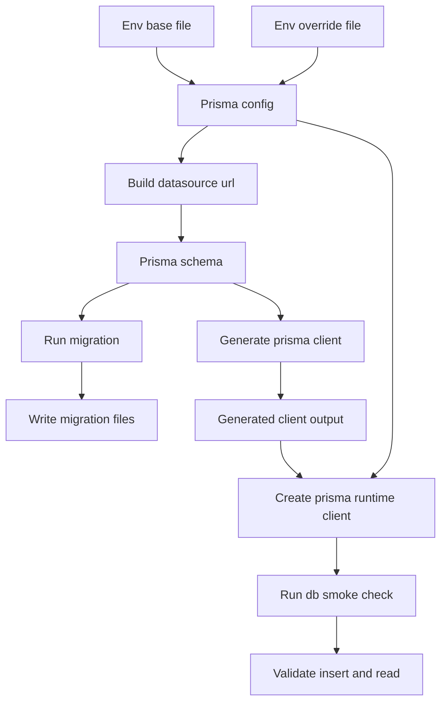
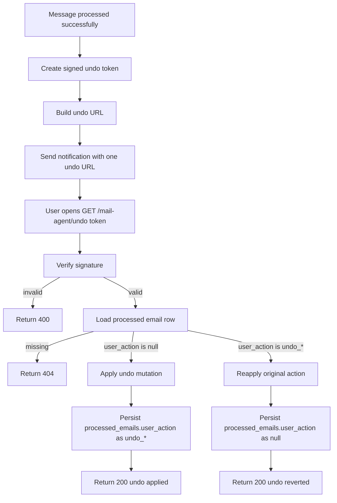
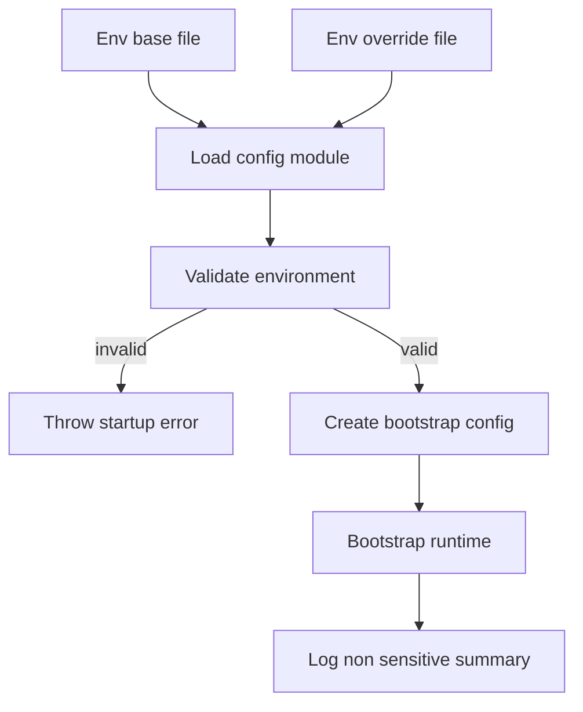
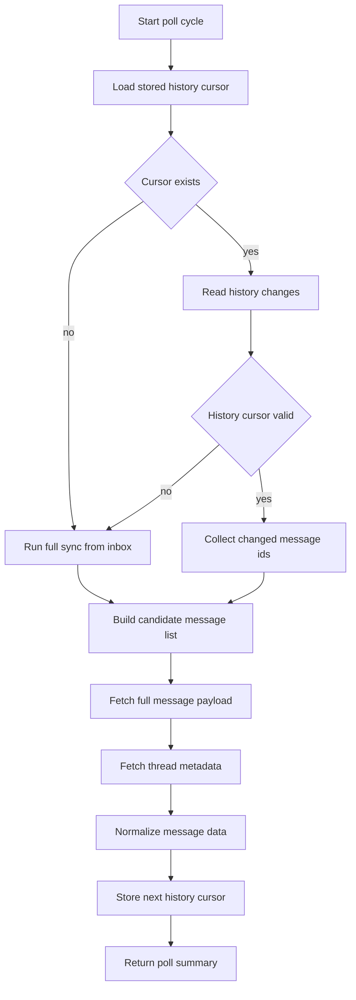
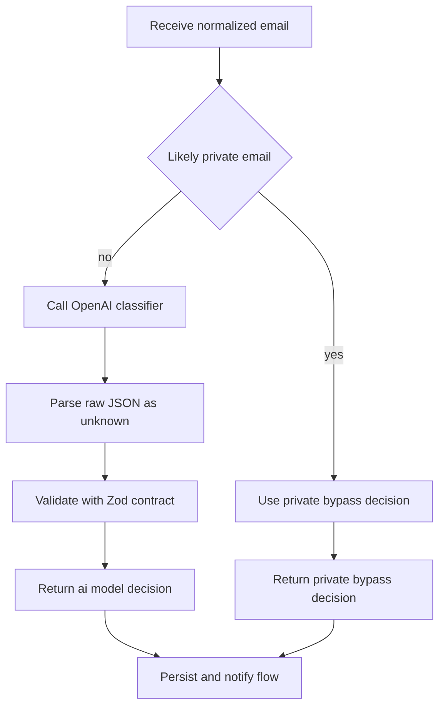
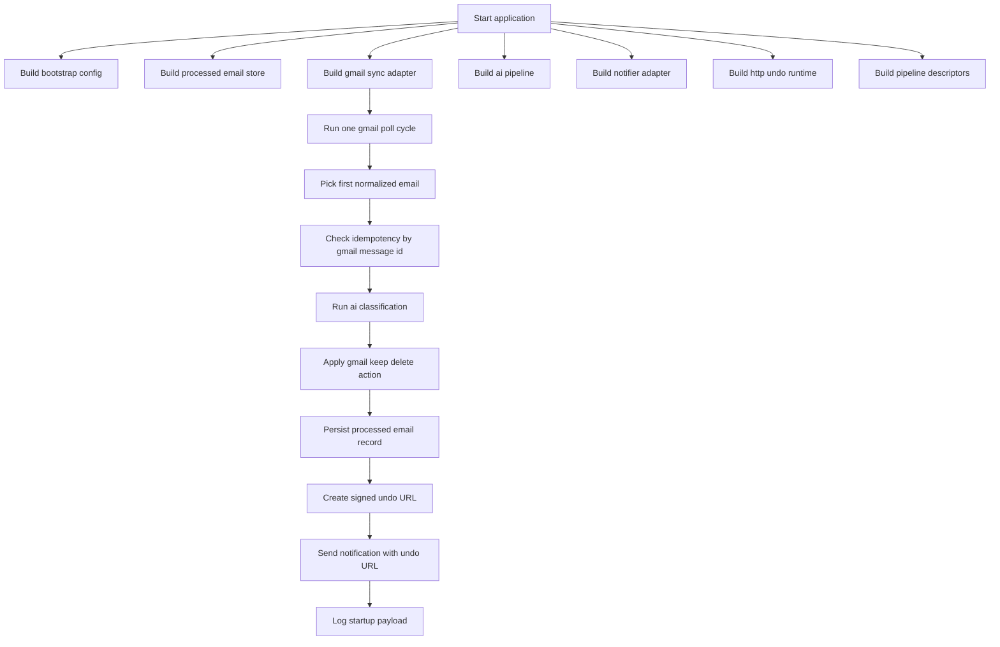
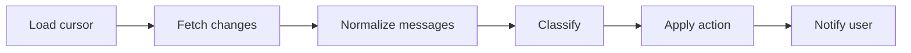

# Mail Agent (`apps/mail-agent`)

This workspace migrates the former n8n mail workflow into versioned monorepo code.

## Current Status

- Implemented: **Step 7** from `current/plan.md`
- The workspace now includes AI classification, Gmail action application, idempotent persistence, Telegram-capable notifier adapter, and signed undo endpoint runtime.

## Usable After Step 1

### Workspace commands

- `bun run --filter mail-agent start` runs the bootstrap flow once.
- `bun run --filter mail-agent dev` runs watch mode for fast iteration.
- `bun run --filter mail-agent check-types` validates TypeScript contracts.
- `bun run --filter mail-agent lint` validates code quality.
- `bun run --filter mail-agent test` runs the smoke test suite.

### Available runtime contracts

The codebase already exposes stable module boundaries for later implementation:

- `src/config`: bootstrap config contract
- `src/data`: processed-email store contract (Prisma-backed)
- `src/gmail`: Gmail sync module with OAuth2, cursor polling, and normalization
- `src/ai`: classifier decision pipeline
- `src/notify`: notifier interface + Telegram adapter with noop fallback
- `src/http`: undo runtime with signed token validation and Gmail reversal endpoint
- `src/pipeline`: canonical pipeline stage contract

## Usable After Step 2

### Prisma configuration baseline

- `prisma.config.ts` loads `.env.base` first and optional `.env` as override.
- `DATABASE_URL` is required.
- `DATABASE_SCHEMA_NAME` is required and must equal `mail`.
- Prisma datasource URL is built as `${DATABASE_URL}?schema=${DATABASE_SCHEMA_NAME}`.

### Database schema and migration state

- `prisma/schema.prisma` defines:
  - `processed_emails`
  - `agent_state`
- Initial migration is present in `prisma/migrations/`.
- Prisma client output is generated under `src/generated/prisma`.

### Prisma runtime access

- `src/data/prisma.ts` exposes a Prisma client with `@prisma/adapter-pg`.
- Adapter schema binding uses `DATABASE_SCHEMA_NAME` from `prisma.config.ts`.
- `src/data/prisma-smoke.ts` performs an insert/read smoke check for both tables.

## Usable After Step 3

### Fail-fast runtime configuration

- `src/config/index.ts` loads `.env.base` first, then optional `.env` override.
- Startup validates env with Zod and throws a clear error on the first boot when values are missing or invalid.
- `DATABASE_SCHEMA_NAME` is strictly validated as `mail`.
- Parsed config is exposed through `createBootstrapConfig()` for all runtime modules.

### Runtime bootstrap wiring

- `src/index.ts` now uses validated config values in the startup payload.
- Runtime logs include only non-sensitive configuration summary (schema, labels, poll interval, telegram parse mode).
- Secret values (API keys, client secrets, tokens) are never logged.

### Required environment variables

- `DATABASE_URL`
- `DATABASE_SCHEMA_NAME` (`mail`)
- `MAIL_AGENT_OPENAI_API_KEY` (required for non-private AI model path)
- `MAIL_AGENT_OPENAI_MODEL` (required for non-private AI model path)
- `MAIL_AGENT_PUBLIC_BASE_URL`
- `MAIL_AGENT_GMAIL_CLIENT_ID`
- `MAIL_AGENT_GMAIL_CLIENT_SECRET`
- `MAIL_AGENT_GMAIL_REFRESH_TOKEN`
- `MAIL_AGENT_POLL_INTERVAL_MS`
- `MAIL_AGENT_LABEL_AI_LABEL_PREFIX`
- `MAIL_AGENT_LABEL_KEEP`
- `MAIL_AGENT_LABEL_DELETE`
- `MAIL_AGENT_LABEL_HIDDEN`
- `MAIL_AGENT_UNDO_TOKEN_SECRET`
- `MAIL_AGENT_TELEGRAM_BOT_TOKEN` (required once real notifier is enabled)
- `MAIL_AGENT_TELEGRAM_CHAT_ID` (required once real notifier is enabled)
- `MAIL_AGENT_TELEGRAM_ALLOWED_USER_IDS` (optional)
- `MAIL_AGENT_TELEGRAM_PARSE_MODE`

Managed label behavior:

- `MAIL_AGENT_LABEL_AI_LABEL_PREFIX` defines the root (for example `ai-managed`)
- `MAIL_AGENT_LABEL_KEEP`, `MAIL_AGENT_LABEL_DELETE`, and `MAIL_AGENT_LABEL_HIDDEN` are suffixes (for example `keep`, `soft-delete`, `hidden`)
- Runtime composes full label names as `${MAIL_AGENT_LABEL_AI_LABEL_PREFIX}/${suffix}`

## Prisma Flow (Step 2)



## Usable After Step 7

### Notifier abstraction with Telegram adapter

- `src/notify/index.ts` keeps `Notifier` as the stable interface boundary.
- Runtime chooses adapter by configuration:
  - if `MAIL_AGENT_TELEGRAM_BOT_TOKEN` and `MAIL_AGENT_TELEGRAM_CHAT_ID` are present, Telegram Bot API is used
  - otherwise a noop notifier is used for local runs
- Telegram adapter behavior:
  - adds status line with emoji (`✅ keep` / `🗑️ deleted`) based on current applied action
  - updates that emoji by editing the existing Telegram message (`editMessageText`) after undo toggle
  - does not send a second status message for undo updates
  - escapes MarkdownV2 content before sending
  - chunks messages to max `4096` characters
  - retries bounded on `429` using `retry_after`

### Undo endpoint and signed token flow

- `src/http/index.ts` starts a Bun HTTP runtime and exposes `GET /mail-agent/undo?token=...`.
- `createUndoUrl(gmailMessageId)` creates a signed HMAC token containing:
  - token version
  - `gmailMessageId`
- Undo handler validates token signature before applying any mutation.
- Undo link is reusable and toggles state on each valid call:
  - when `user_action` is `null`: reverse Gmail action via `gmail.applyUndoAction(...)` and persist `undo_*`
  - when `user_action` is `undo_*`: re-apply original Gmail action via `gmail.applyAction(...)` and persist `null`

### Gmail-side undo behavior

- Undo delete (`appliedAction = delete`): add `INBOX` + keep label, remove delete + hidden labels.
- Undo keep (`appliedAction = keep`): add delete label, remove `INBOX` + keep + hidden labels.
- `processed_emails.user_action` is updated to `undo_delete` or `undo_keep` after successful reversal.

## Undo Runtime Flow (Step 7)



## Config Bootstrap Flow (Step 3)



## Usable After Step 4

### Gmail OAuth2 + API client wiring

- `src/gmail/index.ts` creates a Gmail API client with OAuth2 refresh-token auth.
- Required scopes are configured for `gmail.modify` and `gmail.labels`.

### Cursor-based polling with persistence

- The cursor is the last known Gmail history position (`historyId`) stored in `agent_state.gmail_history_id`.
- Conceptually, it is a checkpoint pointer for mailbox changes, not a message id and not a timestamp. This comes from the gmail API and is managed by gmail itself.
- Polling reads this stored cursor and requests only changes after this checkpoint via `users.history.list(startHistoryId=...)`.
- New incoming emails create new Gmail history entries. On the next poll run, those entries are returned as incremental changes and converted into candidate message ids.
- After processing the poll result, the newest returned `historyId` is persisted back to `agent_state` as the next checkpoint.
- This keeps normal operation incremental (`only changes since last run`) instead of repeatedly scanning the whole mailbox.

### Full-sync fallback

- Full sync is needed when no checkpoint exists yet (first run) or when the stored checkpoint is no longer valid.
- A checkpoint can become invalid when Gmail history retention no longer covers that old `historyId` (for example after longer downtime). Gmail then rejects `startHistoryId` with `404`.
- In this case, the agent switches to full sync to rebuild a valid baseline from current mailbox state:
  - load mailbox candidates via `users.messages.list`
  - read a fresh valid current `historyId` via `users.getProfile`
- The fresh cursor is persisted to `agent_state`, so following runs continue in incremental history mode again.
- Result: the fallback is a recovery mechanism that restores a valid checkpoint and prevents the pipeline from getting permanently stuck on an outdated cursor.

### Message + thread normalization helpers

- Each candidate message is fetched with `users.messages.get(format=full)`.
- Thread context is fetched with `users.threads.get(format=metadata)`.
- Normalized payload includes sender/recipients, subject, labels, text body, reduced HTML body, thread participants, and timestamps.

## Gmail Sync Flow (Step 4)



## Usable After Step 5

### AI classification paths

- `src/ai/index.ts` now provides real classification routing with two paths:
  - `private_bypass`: likely private emails skip model classification and are always kept
  - `ai_model`: non-private emails are classified by OpenAI
- Classifier system prompt stays in German and follows the extracted n8n prompt structure (`Rolle`, `Aufgabe`, `Behalten oder Löschen`, `Zusammenfassung`, `Ausgabe`) as closely as possible.
- Classifier output contract is enforced via Zod with strict fields:
  - `deleteIt`
  - `summary`
  - `subject`
  - `reason`

### Non-private model classification

- Non-private emails call OpenAI with `MAIL_AGENT_OPENAI_MODEL`.
- Model output is treated as untrusted JSON and parsed as `unknown` before Zod validation.
- Invalid or malformed model output throws a clear parsing error.

### Temporary AI smoke test

- `bun run --filter mail-agent ai:smoke` executes:
  - one private sample (must bypass AI)
  - one non-private sample (must use model path or return clear config/model error)
  - one malformed output parse check (must throw validation error)

## AI Decision Flow (Step 5)



### Bootstrap behavior

`start` currently executes an end-to-end bootstrap flow:

1. Build bootstrap config
2. Build adapters (processed-email store, Gmail sync, AI pipeline, notifier, HTTP undo runtime)
3. Execute one Gmail sync poll run (`history` or `full_sync`)
4. Pick first normalized mail and run idempotency check by `gmailMessageId`
5. Classify mail (`private_bypass` or `ai_model`)
6. Apply Gmail action (`keep` or `delete`) with configured labels
7. Persist processing result to `processed_emails`
8. Generate one signed undo URL for the processed `gmailMessageId`
9. Emit one notification payload with exactly one undo URL
10. Print structured runtime state to stdout (including Gmail, AI, action, notification, and idempotency summary)

## Runtime Flow (Step 1)



## Logical Pipeline Contract (Step 1)

The canonical pipeline stages are already fixed in code and validated by test:



## Quick Start

From repository root:

```bash
bun run --filter mail-agent start
```

For watch mode:

```bash
bun run --filter mail-agent dev
```

Configure local secrets by copying template values into `.env`:

```bash
cp apps/mail-agent/.env.example apps/mail-agent/.env
```

---

## Step 4

### GCP setup — detailed guide

#### 1. Create a Google Cloud project

1. Open [Google Cloud Console](https://console.cloud.google.com/).
2. Click the project dropdown in the top-left header.
3. Click **"New Project"**.
4. Enter a project name (for example, "Gmail Local Reader").
5. Organization can stay empty for private usage.
6. Click **"Create"** and switch to the new project.

#### 2. Enable Gmail API

1. Open **APIs & Services -> Library** or [API Library](https://console.cloud.google.com/apis/library).
2. Search for **"Gmail API"**.
3. Select **"Gmail API"** from results.
4. Click **"Enable"**.

#### 3. Configure OAuth consent screen

1. Open **Google Auth Platform -> Branding** or [OAuth Consent Screen](https://console.cloud.google.com/auth/branding).
   - If not configured yet, click **"Get Started"**.

2. **App information**:
   - **App name**: for example, "Gmail Local Reader". Google validates this and it should look like a real app name. See [naming examples](https://support.google.com/cloud/answer/15549049?visit_id=639117854563019737-2224445486&rd=1#app-name&zippy=%2Capp-name).
   - **User support email**: select your email.

3. **Audience**:
   - **User type**: **"External"** (required for `@gmail.com` accounts).

4. **Contact information**:
   - Add your developer notification email.

5. **Finish**:
   - Accept the Google API Services User Data Policy.
   - Click **"Create"**.

##### Add scopes

1. Open **Google Auth Platform -> Data Access**.
2. Click **"Add or Remove Scopes"**.
3. Add these scopes:
   - `https://www.googleapis.com/auth/gmail.modify` (restricted)
   - `https://www.googleapis.com/auth/gmail.labels` (non-sensitive)
4. Click **"Update"** and **"Save"**.

> [!info] `gmail.modify` is classified as **restricted**. For personal-use apps (up to 100 users), the personal-use exception applies and CASA verification is not required. `gmail.labels` is non-sensitive.

##### Add test users

1. Open **Google Auth Platform -> Audience**.
2. In **"Test users"**, click **"Add users"**.
3. Add your Gmail address (the mailbox you want to read).
4. Save.

> [!warning] In testing mode, only configured test users can complete the consent flow.

##### Set publishing status to production

1. Open **Google Auth Platform -> Audience**.
2. Find **"Publishing status"** and click **"Publish App"**.
3. Confirm.

> [!warning] Critical: in testing mode, refresh tokens can expire after about 7 days. After switching to production, create new OAuth credentials and complete consent again; old testing-mode refresh tokens keep their original expiration behavior.

4. You can ignore the review submission message for this personal-use setup.

#### 4. Create OAuth client credentials

1. Open **Google Auth Platform -> Clients** or [Credentials Page](https://console.cloud.google.com/auth/clients).
2. Click **"+ Create Client"**.
3. Choose **"Desktop app"** as application type.
4. Enter a name (for example, "Gmail Local Reader Desktop" or `app-mail`).
5. Click **"Create"**.
6. Copy or download credentials immediately:
   - download the JSON credentials file
   - client secret is fully visible only at creation time
7. Store values in `MAIL_AGENT_GMAIL_CLIENT_ID` and `MAIL_AGENT_GMAIL_CLIENT_SECRET`.

> [!tip] Why use a desktop app instead of web application?
> For desktop app clients, you do not need to manually configure redirect URIs. Google automatically allows loopback addresses (`http://127.0.0.1`, `http://[::1]`, `http://localhost`) on any port. With web application clients, localhost redirect URIs must be configured manually.

### 5) Generate one refresh token

Run one OAuth consent flow and store the returned refresh token.

From repository root:

```bash
bun run --filter mail-agent gmail:auth
```

Behavior of this CLI:

- starts a local callback server on `http://127.0.0.1:3000`
- prints the OAuth consent URL in terminal
- opens the URL automatically on macOS
- prints `MAIL_AGENT_GMAIL_REFRESH_TOKEN="..."` after successful consent

### 6) Fill `apps/mail-agent/.env`

At minimum, set all required values in your `.env`:

```env
MAIL_AGENT_GMAIL_CLIENT_ID="..."
MAIL_AGENT_GMAIL_CLIENT_SECRET="..."
MAIL_AGENT_GMAIL_REFRESH_TOKEN="..."
MAIL_AGENT_UNDO_TOKEN_SECRET="..."
```

Generate `MAIL_AGENT_UNDO_TOKEN_SECRET` once with a cryptographically secure random value:

```bash
openssl rand -hex 32
```

Then copy that output into `MAIL_AGENT_UNDO_TOKEN_SECRET`.

Keep this value stable across restarts. Rotating it invalidates previously generated undo links.

For Step 4 Gmail testing, OpenAI and Telegram secrets can stay empty because those integrations are still placeholders in this stage.

For current runtime, Telegram secrets can still stay empty when you intentionally use noop notifier mode, but `MAIL_AGENT_UNDO_TOKEN_SECRET` is required for signed undo URL generation.

### 7) Initialize DB schema (empty DB)

From repository root:

```bash
bun run --filter mail-agent prisma generate
bun run --filter mail-agent prisma migrate dev --name init
```

If you want to reset smoke artifacts before Gmail tests:

```bash
bun run --filter mail-agent smoke:clean
```

What this resets:

- removes smoke test rows from `processed_emails`
- removes `agent_state` row for `mail-agent-state` (forces next run into full sync)

### 8) Start and validate first Gmail run

From repository root:

```bash
bun run --filter mail-agent start
```

Expected on first run with empty `agent_state`:

- `gmailSync.mode` is `full_sync`
- `gmailSync.cursorAfter` is populated
- `agent_state.gmail_history_id` is stored in DB

Expected on subsequent runs:

- `gmailSync.mode` is usually `history`
- `cursorBefore` and `cursorAfter` reflect incremental sync

### 9) Temporary Gmail read smoke output

Use this temporary command to perform a direct Gmail read (`messages.list` + `messages.get`) and print a mailbox preview:

```bash
bun run --filter mail-agent gmail:smoke
```

Expected outcome:

- JSON output contains `listedMessageCount`, `previewCount`, and `preview`
- `preview` rows include real `sender`, `subject`, `date`, and `labels` values from your mailbox
- this smoke command is temporary and will be removed in the final cleanup step from `current/plan.md`

## Database Setup (Step 2)

From repository root:

```bash
bun run --filter mail-agent prisma generate
bun run --filter mail-agent prisma migrate dev --name init
```

Run DB smoke test:

```bash
bun run --filter mail-agent db:smoke
```

## Step 1 Verification

Run from repository root:

```bash
bun run --filter mail-agent check-types
bun run --filter mail-agent lint
bun run --filter mail-agent test
```

### Expected outcomes

- `check-types`: no TypeScript errors
- `lint`: no ESLint errors
- `test`: one passing smoke test (`pipeline scaffold exposes all planned stages`)

## Step 2 Verification

Run from repository root:

```bash
bun run --filter mail-agent prisma generate
bun run --filter mail-agent prisma migrate dev --name init
bun run --filter mail-agent db:smoke
```

### Expected outcomes

- `prisma generate`: client generated at `src/generated/prisma`
- `prisma migrate dev`: migration directory exists and DB is in sync
- `db:smoke`: JSON output contains non-null `state` and `latestProcessedEmail`

## Step 3 Verification

### Missing core env should fail fast

From repository root:

```bash
MAIL_AGENT_GMAIL_CLIENT_ID= bun run --filter mail-agent start
```

Expected outcome:

- process exits with `Invalid mail-agent environment configuration`

### Full env should start cleanly

From repository root:

```bash
bun run --filter mail-agent start
```

Expected outcome:

- process prints bootstrap JSON including `databaseSchemaName`, `pollIntervalMs`, `labels`, `telegram.parseMode`, and `gmailSync`

## Step 4 Verification

### Poll with valid mailbox

From repository root:

```bash
bun run --filter mail-agent start
```

Expected outcome:

- startup JSON includes `gmailSync.mode`, `gmailSync.cursorBefore`, `gmailSync.cursorAfter`, and candidate/normalized message counts

### Verify persisted cursor

Check `agent_state.gmail_history_id` in your local DB after one successful run.

Expected outcome:

- cursor value is present and changes across subsequent poll cycles

### Simulate invalid cursor fallback

Set an outdated `gmail_history_id` in DB and run `start` again.

Expected outcome:

- poll switches to `gmailSync.mode = full_sync` and stores a new valid cursor

## Step 5 Verification

### Run AI smoke test

From repository root:

```bash
bun run --filter mail-agent ai:smoke
```

Expected outcome:

- `privateSample.path` equals `private_bypass`
- `nonPrivateSample.path` equals `ai_model` when OpenAI env is set
- `nonPrivateError` is a clear config error when OpenAI env is not set
- `malformedModelOutputError` contains an invalid classifier output error

### Run bootstrap with AI summary output

From repository root:

```bash
bun run --filter mail-agent start
```

Expected outcome:

- startup JSON includes `aiClassification.path` when a message is classified
- startup JSON includes `aiClassificationError` when non-private classification cannot run

## Step 6 Verification

### Trace pipeline with debug logging

From repository root:

```bash
DEBUG=app:* bun run --filter mail-agent start
```

Useful namespace filters:

- `DEBUG=app:action:*` for pipeline/action flow
- `DEBUG=app:db:*` for persistence and cursor state operations

Expected debug flow signals:

- `app:action:pollGmail` shows cursor loading, history/full-sync mode, and message counts
- `app:action:main` shows selected message, idempotency decision, classification/action/persistence result
- `app:action:classifyEmail` shows private bypass vs model path and OpenAI output status
- `app:action:applyGmailAction` shows applied action and label mutation counts
- `app:db:hasProcessedMessage` / `app:db:insertProcessedEmail` show idempotency and DB writes

## Step 7 Verification

### Start runtime with undo endpoint enabled

From repository root:

```bash
DEBUG=app:* bun run --filter mail-agent start
```

Expected outcome:

- startup JSON includes `http.enabled: true`
- startup JSON includes `http.undoUrlBase`
- debug logs include `app:action:createHttpRuntime HTTP runtime started`

### Verify notification payload includes one undo URL

Process one message successfully (classification + action + persistence).

Expected outcome:

- startup JSON includes `notificationResult.providerMessageId` (or noop id in fallback mode)
- debug logs show `Notification emitted` and include provider message id
- notification content contains exactly one undo URL

### Verify undo endpoint behavior

Open the undo URL from the notification in browser.

Expected outcome:

- first open returns `Undo applied.`
- second open returns `Undo reverted to original action.`
- third open returns `Undo applied.` again
- `processed_emails.user_action` toggles between `undo_delete` / `undo_keep` and `null`

### Verify Gmail reversal mapping

Expected reversal behavior:

- if original action was delete: undo switches message to keep state (`INBOX` + keep label)
- if original action was keep: undo switches message to deleted state (delete label + `INBOX` removed)

### Verify idempotency guard

Run `start` twice with the same candidate message still present.

Expected outcome:

- second pass sets `idempotencySkipped: true` in startup output
- no duplicate row is inserted for the same `gmail_message_id`

### Verify Gmail action mapping

Expected action behavior:

- messages that already have any label under `MAIL_AGENT_LABEL_AI_LABEL_PREFIX` are skipped from candidates
- when `deleteIt = true`: add `${MAIL_AGENT_LABEL_AI_LABEL_PREFIX}/${MAIL_AGENT_LABEL_DELETE}` (for example `ai-managed/soft-delete`), remove `INBOX`, `${MAIL_AGENT_LABEL_AI_LABEL_PREFIX}/${MAIL_AGENT_LABEL_KEEP}`, and `${MAIL_AGENT_LABEL_AI_LABEL_PREFIX}/${MAIL_AGENT_LABEL_HIDDEN}`
- when `deleteIt = false`: add `${MAIL_AGENT_LABEL_AI_LABEL_PREFIX}/${MAIL_AGENT_LABEL_KEEP}` (for example `ai-managed/keep`), remove `${MAIL_AGENT_LABEL_AI_LABEL_PREFIX}/${MAIL_AGENT_LABEL_DELETE}` and `${MAIL_AGENT_LABEL_AI_LABEL_PREFIX}/${MAIL_AGENT_LABEL_HIDDEN}`

### Verify persistence in `processed_emails`

After a successful run (classification + action + persistence):

- one row exists in `processed_emails` with `gmail_message_id`
- row contains `delete_it`, `applied_action`, and `classifier_output`
- startup JSON shows `actionResult` and `persistenceError: null`

### Common failure cases

- Running commands outside repository root
- Missing workspace dependencies in the monorepo install state
