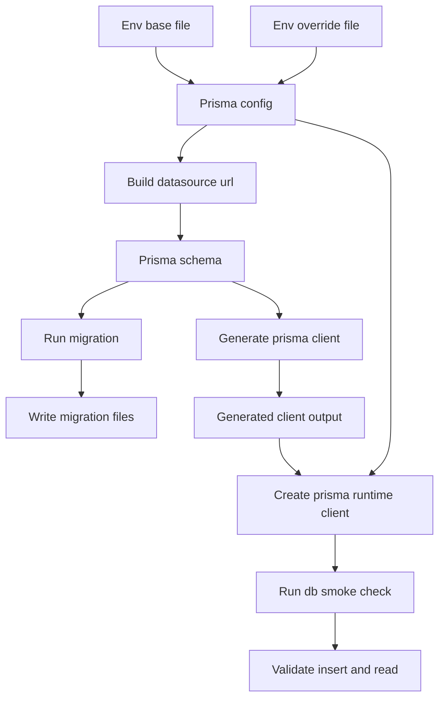
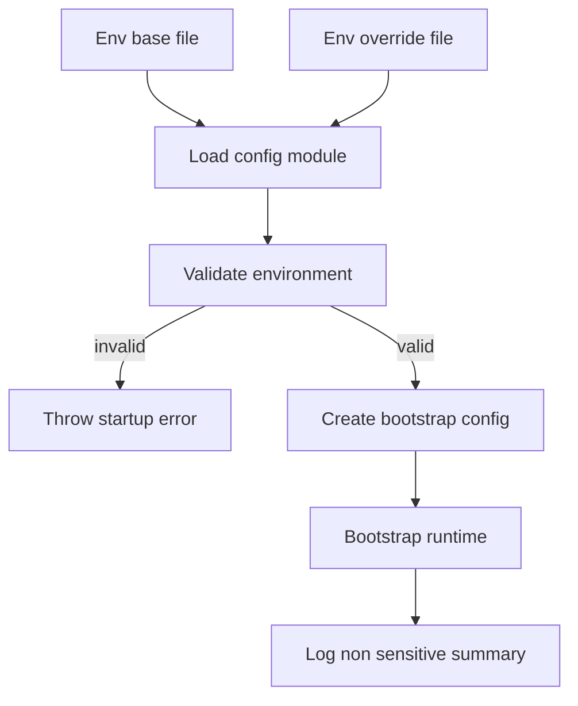
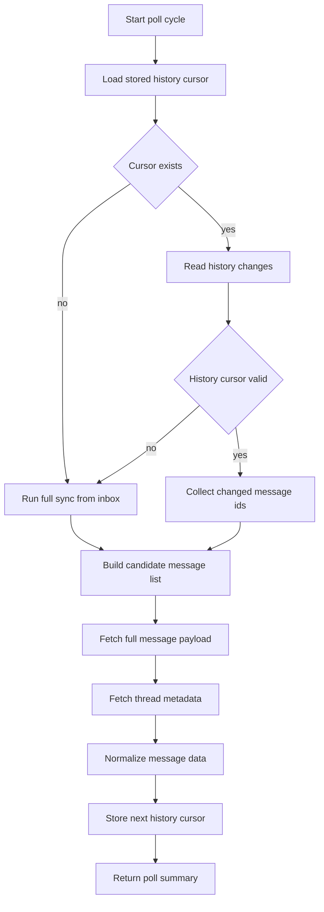
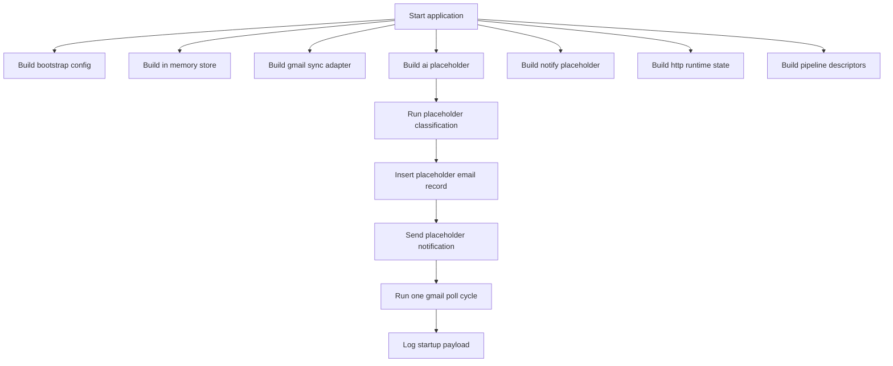
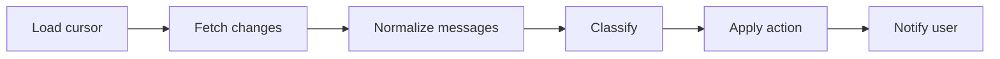

# Mail Agent (`apps/mail-agent`)

This workspace migrates the former n8n mail workflow into versioned monorepo code.

## Current Status

- Implemented: **Step 4** from `current/plan.md`
- The workspace now performs Gmail cursor polling with DB-backed state and 404 full-sync fallback.

## Usable After Step 1

### Workspace commands

- `bun run --filter mail-agent start` runs the bootstrap flow once.
- `bun run --filter mail-agent dev` runs watch mode for fast iteration.
- `bun run --filter mail-agent check-types` validates TypeScript contracts.
- `bun run --filter mail-agent lint` validates code quality.
- `bun run --filter mail-agent test` runs the smoke test suite.

### Available runtime contracts

The codebase already exposes stable module boundaries for later implementation:

- `src/config`: bootstrap config contract
- `src/data`: processed-email store contract (in-memory placeholder)
- `src/gmail`: Gmail sync module with OAuth2, cursor polling, and normalization
- `src/ai`: classifier decision contract placeholder
- `src/notify`: notifier interface and noop adapter
- `src/http`: HTTP runtime placeholder contract (not enabled in step 1)
- `src/pipeline`: canonical pipeline stage contract

## Usable After Step 2

### Prisma configuration baseline

- `prisma.config.ts` loads `.env.base` first and optional `.env` as override.
- `DATABASE_URL` is required.
- `DATABASE_SCHEMA_NAME` is required and must equal `mail`.
- Prisma datasource URL is built as `${DATABASE_URL}?schema=${DATABASE_SCHEMA_NAME}`.

### Database schema and migration state

- `prisma/schema.prisma` defines:
  - `processed_emails`
  - `agent_state`
- Initial migration is present in `prisma/migrations/`.
- Prisma client output is generated under `src/generated/prisma`.

### Prisma runtime access

- `src/data/prisma.ts` exposes a Prisma client with `@prisma/adapter-pg`.
- Adapter schema binding uses `DATABASE_SCHEMA_NAME` from `prisma.config.ts`.
- `src/data/prisma-smoke.ts` performs an insert/read smoke check for both tables.

## Usable After Step 3

### Fail-fast runtime configuration

- `src/config/index.ts` loads `.env.base` first, then optional `.env` override.
- Startup validates env with Zod and throws a clear error on the first boot when values are missing or invalid.
- `DATABASE_SCHEMA_NAME` is strictly validated as `mail`.
- Parsed config is exposed through `createBootstrapConfig()` for all runtime modules.

### Runtime bootstrap wiring

- `src/index.ts` now uses validated config values in the startup payload.
- Runtime logs include only non-sensitive configuration summary (schema, labels, poll interval, telegram parse mode).
- Secret values (API keys, client secrets, tokens) are never logged.

### Required environment variables

- `DATABASE_URL`
- `DATABASE_SCHEMA_NAME` (`mail`)
- `MAIL_AGENT_OPENAI_API_KEY`
- `MAIL_AGENT_OPENAI_MODEL`
- `MAIL_AGENT_PUBLIC_BASE_URL`
- `MAIL_AGENT_GMAIL_CLIENT_ID`
- `MAIL_AGENT_GMAIL_CLIENT_SECRET`
- `MAIL_AGENT_GMAIL_REFRESH_TOKEN`
- `MAIL_AGENT_POLL_INTERVAL_MS`
- `MAIL_AGENT_LABEL_AI_MANAGED`
- `MAIL_AGENT_LABEL_KEEP`
- `MAIL_AGENT_LABEL_DELETE`
- `MAIL_AGENT_TELEGRAM_BOT_TOKEN`
- `MAIL_AGENT_TELEGRAM_CHAT_ID`
- `MAIL_AGENT_TELEGRAM_ALLOWED_USER_IDS` (optional)
- `MAIL_AGENT_TELEGRAM_PARSE_MODE`

## Prisma Flow (Step 2)



## Config Bootstrap Flow (Step 3)



## Usable After Step 4

### Gmail OAuth2 + API client wiring

- `src/gmail/index.ts` creates a Gmail API client with OAuth2 refresh-token auth.
- Required scopes are configured for `gmail.modify` and `gmail.labels`.

### Cursor-based polling with persistence

- Poll reads `agent_state.gmail_history_id` as incremental cursor.
- If cursor exists, sync uses `users.history.list(startHistoryId=...)`.
- Updated cursor is persisted back to `agent_state` after successful polling.

### Full-sync fallback

- If Gmail history call fails with invalid/expired cursor (`404`), sync switches to full sync.
- Full sync loads current mailbox messages (`users.messages.list`) and profile cursor (`users.getProfile`).
- New cursor is persisted so later runs return to incremental history polling.

### Message + thread normalization helpers

- Each candidate message is fetched with `users.messages.get(format=full)`.
- Thread context is fetched with `users.threads.get(format=metadata)`.
- Normalized payload includes sender/recipients, subject, labels, text body, reduced HTML body, thread participants, and timestamps.

## Gmail Sync Flow (Step 4)



### Bootstrap behavior

`start` currently executes an end-to-end scaffold flow:

1. Build bootstrap config
2. Build adapters (data, Gmail sync, AI placeholder, notify placeholder, HTTP state)
3. Execute one placeholder classification decision
4. Persist one placeholder processed-email record in-memory
5. Emit one placeholder notification payload
6. Execute one Gmail sync poll run (`history` or `full_sync`)
7. Print structured runtime state to stdout (including Gmail poll summary)

## Runtime Flow (Step 1)



## Logical Pipeline Contract (Step 1)

The canonical pipeline stages are already fixed in code and validated by test:



## Quick Start

From repository root:

```bash
bun run --filter mail-agent start
```

For watch mode:

```bash
bun run --filter mail-agent dev
```

Configure local secrets by copying template values into `.env`:

```bash
cp apps/mail-agent/.env.example apps/mail-agent/.env
```

---

### GCP-Setup — Detaillierte Anleitung

#### 1. Google Cloud Projekt erstellen

1. Oeffne [Google Cloud Console](https://console.cloud.google.com/)
2. Klicke oben links auf das **Projekt-Dropdown** (neben "Google Cloud")
3. Klicke **"Neues Projekt"** im Dialog
4. **Projektname** eingeben (z.B. "Gmail Local Reader")
5. Organisation kann leer bleiben (fuer private Konten)
6. Klicke **"Erstellen"** → Warte auf Notification → **Zum neuen Projekt wechseln**

#### 2. Gmail API aktivieren

1. Gehe zu **APIs & Services → Bibliothek** (linkes Menue) oder direkt: [API Library](https://console.cloud.google.com/apis/library)
2. Suche nach **"Gmail API"**
3. Klicke auf **"Gmail API"** in den Ergebnissen
4. Klicke **"Aktivieren"** (blauer Button)

#### 3. OAuth Consent Screen konfigurieren

1. Gehe zu **Google Auth Platform → Branding** oder: [OAuth Consent Screen](https://console.cloud.google.com/auth/branding)
   - Falls noch nicht konfiguriert: Klicke **"Get Started"**

2. **App-Informationen** (Seite 1):
   - **App-Name**: z.B. "Gmail Local Reader". Das wird abgeprüft und muss nach einer App klingen. [Hier sind Beispiele zu sehen.](https://support.google.com/cloud/answer/15549049?visit_id=639117854563019737-2224445486&rd=1#app-name&zippy=%2Capp-name)
   - **User-Support-E-Mail**: Deine E-Mail-Adresse auswaehlen
   - Klicke **"Weiter"**

3. **Zielgruppe** (Seite 2):
   - **User Type**: **"Extern"** (fuer @gmail.com die einzige Option)
   - Klicke **"Weiter"**

4. **Kontaktinformationen** (Seite 3):
   - **E-Mail fuer Entwicklerbenachrichtigungen**: Deine E-Mail eintragen
   - Klicke **"Weiter"**

5. **Abschluss** (Seite 4):
   - Haken bei **"Ich stimme den Google API Services: User Data Policy zu"**
   - Klicke **"Erstellen"**

##### Scopes hinzufuegen

1. Gehe zu **Google Auth Platform → Data Access** linke seite im Menü
2. Klicke **"Add or Remove Scopes"**
3. Folgende Scopes hinzufuegen (einzeln suchen/eingeben, Haken setzen):
   - `https://www.googleapis.com/auth/gmail.modify` (restricted)
   - `https://www.googleapis.com/auth/gmail.labels` (non-sensitive)
4. **"Aktualisieren"** → **"Speichern"**

> [!info] `gmail.modify` ist als **restricted** klassifiziert. Fuer Personal Use (max 100 User) greift die **Personal-Use-Ausnahme** — keine CASA-Verifizierung noetig. `gmail.labels` ist non-sensitive.

##### Test-User hinzufuegen

1. Gehe zu **Google Auth Platform → Audience**
2. Im Abschnitt **"Test users"** klicke **"Add users"**
3. **Deine Gmail-Adresse** eingeben (deren Mails gelesen werden sollen)
4. **"Speichern"**

> [!warning] Im Testing-Modus koennen **nur** eingetragene Test-User den Consent-Flow durchlaufen.

##### Publishing Status auf "In Production" setzen

1. Gehe zu **Google Auth Platform → Audience**
2. Finde **"Publishing status"** → Klicke **"Publish App"**
3. Bestaetigen

> [!warning] KRITISCH: Testing-Modus = Refresh Token laeuft nach 7 Tagen ab!
> Nach dem Wechsel von Testing zu Production **neue OAuth-Credentials erstellen** und **neuen Consent durchfuehren** — alte Refresh Tokens aus dem Testing-Modus behalten das 7-Tage-Ablaufdatum! Deswegen erst danach den oauth flow durchaufen.

4. Den Text "Die Anwendung muss überprüft werden. Reichen Sie die Anwendung zur Überprüfung ein, wenn Sie mit der Eingabe Ihrer Informationen fertig sind." ignorieren.

#### 4. OAuth Client-ID erstellen

1. Gehe zu **Google Auth Platform → Clients** oder: [Credentials Page](https://console.cloud.google.com/auth/clients)
2. Klicke **"+ Create Client"**
3. **Application type**: **"Desktop app"** auswaehlen. 
4. **Name**: z.B. "Gmail Local Reader Desktop". Hier geht wieder was einfaches wie `app-mail`.
5. Klicke **"Erstellen"**
6. **Client-ID und Client-Secret** werden angezeigt — **sofort herunterladen!**
   - Klicke **"JSON herunterladen"** fuer die Credentials-Datei
   - Das Secret ist nur bei Erstellung vollstaendig sichtbar
7. Speichern in: `MAIL_AGENT_GMAIL_CLIENT_ID` und `MAIL_AGENT_GMAIL_CLIENT_SECRET`

> [!tip] **Warum "Desktop app" und nicht "Web application"?**
> Bei **"Desktop app"** muss **keine Redirect-URI manuell konfiguriert** werden. Google erlaubt fuer diesen Client-Typ automatisch alle Loopback-Adressen (`http://127.0.0.1`, `http://[::1]`, `http://localhost`) auf **jedem Port**. Bei "Web application" muesste jede `http://localhost:<port>/...`-URL einzeln in der Console eingetragen werden.

---

## Gmail Local Setup (Required for Step 4 Tests)

This section is the shortest path from an empty local database to a real Gmail poll run.

### 1) Google Cloud project and Gmail API

1. Create or open a Google Cloud project.
2. Enable `Gmail API`.
3. Configure OAuth consent screen (`External`).
4. Add scopes:
   - `https://www.googleapis.com/auth/gmail.modify`
   - `https://www.googleapis.com/auth/gmail.labels`
5. Add your Gmail address as test user.
6. Set publishing status to `In production` before creating your final refresh token.

Why production status matters:

- refresh tokens from testing mode can expire after ~7 days
- after switching to production, generate a fresh token again

### 2) Create OAuth client credentials

Create OAuth client type `Desktop app` and keep:

- `client_id`
- `client_secret`

Desktop app is recommended for local usage because loopback redirect is supported without manual URI management.

### 3) Generate one refresh token

Run one OAuth consent flow and store the returned refresh token.

Minimal requirements for the flow:

- `access_type=offline`
- `prompt=consent`
- same two Gmail scopes as above

After consent, store:

- `MAIL_AGENT_GMAIL_REFRESH_TOKEN`

### 4) Fill `apps/mail-agent/.env`

At minimum, set all required values:

```env
DATABASE_URL=postgresql://...
DATABASE_SCHEMA_NAME=mail

MAIL_AGENT_OPENAI_API_KEY=...
MAIL_AGENT_OPENAI_MODEL=...
MAIL_AGENT_PUBLIC_BASE_URL=http://localhost:3070

MAIL_AGENT_GMAIL_CLIENT_ID=...
MAIL_AGENT_GMAIL_CLIENT_SECRET=...
MAIL_AGENT_GMAIL_REFRESH_TOKEN=...
MAIL_AGENT_POLL_INTERVAL_MS=60000
MAIL_AGENT_LABEL_AI_MANAGED=ai-managed
MAIL_AGENT_LABEL_KEEP=ai-keep
MAIL_AGENT_LABEL_DELETE=ai-delete

MAIL_AGENT_TELEGRAM_BOT_TOKEN=...
MAIL_AGENT_TELEGRAM_CHAT_ID=...
MAIL_AGENT_TELEGRAM_ALLOWED_USER_IDS=
MAIL_AGENT_TELEGRAM_PARSE_MODE=MarkdownV2
```

### 5) Initialize DB schema (empty DB)

From repository root:

```bash
bun run --filter mail-agent prisma generate
bun run --filter mail-agent prisma migrate dev --name init
```

If you want to reset smoke artifacts before Gmail tests:

```bash
bun run --filter mail-agent smoke:clean
```

What this resets:

- removes smoke test rows from `processed_emails`
- removes `agent_state` row for `mail-agent-state` (forces next run into full sync)

### 6) Start and validate first Gmail run

From repository root:

```bash
bun run --filter mail-agent start
```

Expected on first run with empty `agent_state`:

- `gmailSync.mode` is `full_sync`
- `gmailSync.cursorAfter` is populated
- `agent_state.gmail_history_id` is stored in DB

Expected on subsequent runs:

- `gmailSync.mode` is usually `history`
- `cursorBefore` and `cursorAfter` reflect incremental sync

## Database Setup (Step 2)

From repository root:

```bash
bun run --filter mail-agent prisma generate
bun run --filter mail-agent prisma migrate dev --name init
```

Run DB smoke test:

```bash
bun run --filter mail-agent db:smoke
```

## Step 1 Verification

Run from repository root:

```bash
bun run --filter mail-agent check-types
bun run --filter mail-agent lint
bun run --filter mail-agent test
```

### Expected outcomes

- `check-types`: no TypeScript errors
- `lint`: no ESLint errors
- `test`: one passing smoke test (`pipeline scaffold exposes all planned stages`)

## Step 2 Verification

Run from repository root:

```bash
bun run --filter mail-agent prisma generate
bun run --filter mail-agent prisma migrate dev --name init
bun run --filter mail-agent db:smoke
```

### Expected outcomes

- `prisma generate`: client generated at `src/generated/prisma`
- `prisma migrate dev`: migration directory exists and DB is in sync
- `db:smoke`: JSON output contains non-null `state` and `latestProcessedEmail`

## Step 3 Verification

### Missing env should fail fast

From repository root:

```bash
MAIL_AGENT_OPENAI_API_KEY= bun run --filter mail-agent start
```

Expected outcome:

- process exits with `Invalid mail-agent environment configuration`

### Full env should start cleanly

From repository root:

```bash
bun run --filter mail-agent start
```

Expected outcome:

- process prints bootstrap JSON including `databaseSchemaName`, `pollIntervalMs`, `labels`, and `telegram.parseMode`

## Step 4 Verification

### Poll with valid mailbox

From repository root:

```bash
bun run --filter mail-agent start
```

Expected outcome:

- startup JSON includes `gmailSync.mode`, `gmailSync.cursorBefore`, `gmailSync.cursorAfter`, and candidate/normalized message counts

### Verify persisted cursor

Check `agent_state.gmail_history_id` in your local DB after one successful run.

Expected outcome:

- cursor value is present and changes across subsequent poll cycles

### Simulate invalid cursor fallback

Set an outdated `gmail_history_id` in DB and run `start` again.

Expected outcome:

- poll switches to `gmailSync.mode = full_sync` and stores a new valid cursor

### Common failure cases

- Running commands outside repository root
- Missing workspace dependencies in the monorepo install state
