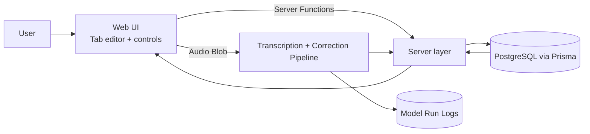
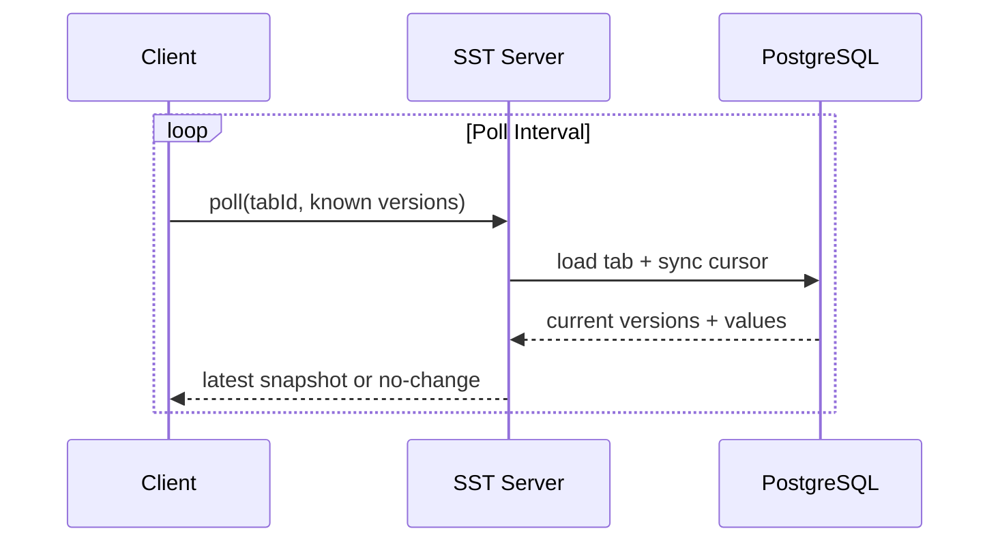
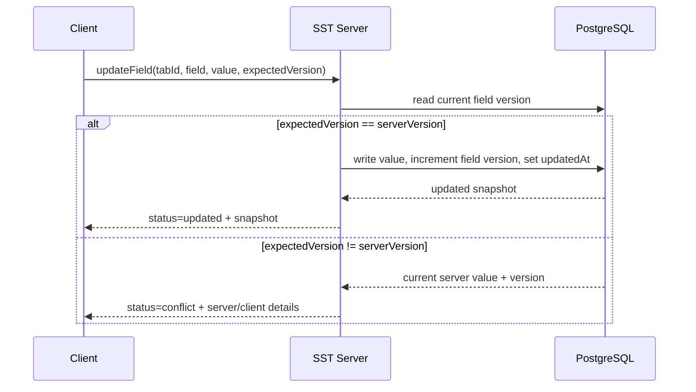
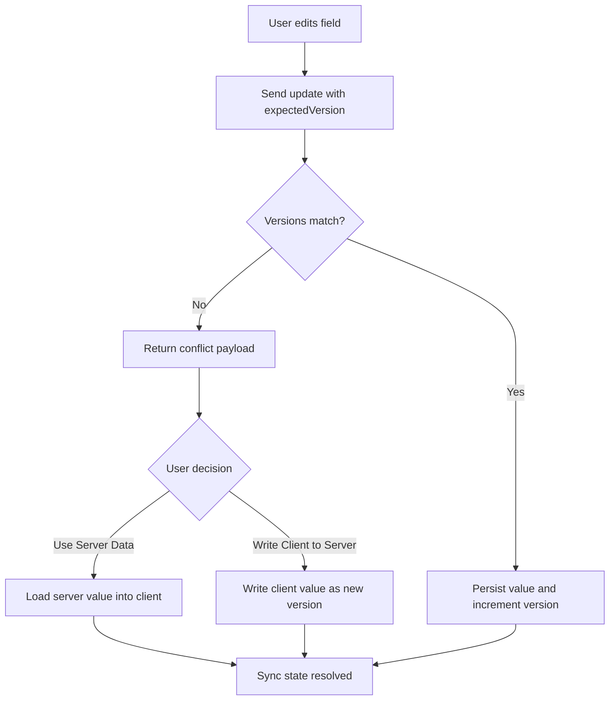
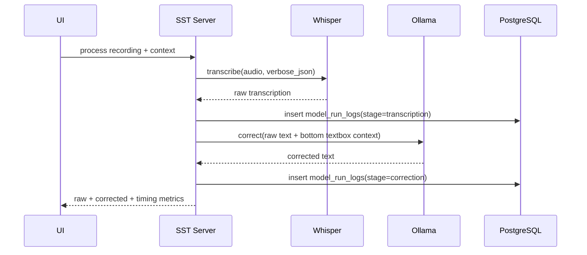
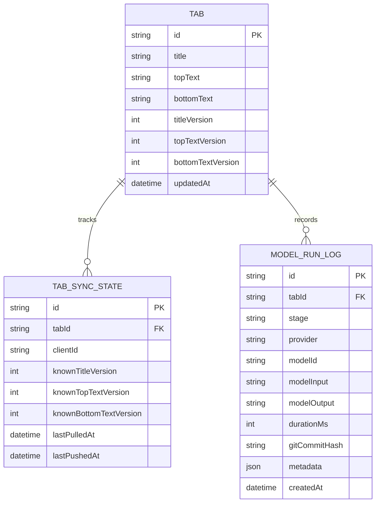

# SST v0

SST is a TanStack Start app for speech-to-text workflows with conflict-safe tab syncing and model-run telemetry.

The original `apps/sst-web` app remains untouched. `apps/sst` is the new v0 implementation with a server-backed architecture.

## Goals of v0

- Multiple tabs for parallel thought streams.
- Field-level conflict protection for tab title, top text, and bottom text.
- Polling-based multi-client synchronization runtime.
- Local audio replay (not synchronized).
- Automatic recording-stop processing (Whisper + Ollama) into top text.
- Persisted model-run telemetry for future quality/cost evaluation.

## Current Editor + Recording Flow

This is the current intended workflow in the app:

1. Start recording with the `start` button.
2. While recording, the button label is `recording`.
3. Press `recording` again to stop.
4. On stop, SST automatically:
   - keeps the local audio blob for replay,
   - calls `improveTabRecordingFn`,
   - writes `correctedText` into the top textbox,
   - persists that top text to the server.
5. Review and edit top text.
6. Top text edits are auto-saved with a 1-second throttle.
7. Press `Put` to append top text to bottom text and clear top text.
8. Bottom text changes are auto-saved on change.
9. Use `Delete Tab` (next to `Debug`) to delete the active tab.
10. Or use scissors (`✂️`) to copy bottom text and delete the active tab.

## Whisper Server Setup (Local)

Run these steps from `apps/sst`.

Install Whisper server tooling via Homebrew:

```bash
brew install whisper-cpp
```

Download the model file:

```bash
mkdir -p models
curl -L -o models/ggml-large-v3-turbo.bin \
  "https://huggingface.co/ggerganov/whisper.cpp/resolve/main/ggml-large-v3-turbo.bin"
```

Start the local Whisper server:

```bash
whisper-server \
  -m models/ggml-large-v3-turbo.bin \
  --host 0.0.0.0 \
  --port 9100 \
  -l de \
  -t 4
```

## Install as App (Manifest)

SST now includes a web manifest (`/site.webmanifest`) and app icon (`/icons/sst-icon.svg`).

After opening SST in the browser, use the browser install flow (for example `Add to Home Screen` / `Install app`) to create an app-style home-screen entry instead of only a plain bookmark.

## Development

Run the app on port `3059`:

```bash
bun run dev --filter=@repo/sst
```

Run repository checks:

```bash
bun run ci
```

Run app-local checks:

```bash
bun run check-types --filter=@repo/sst
bun run lint --filter=@repo/sst
```

Required AI pipeline env vars (loaded from `.env.base` and overridden by `.env`):

```bash
SST_WHISPER_ENDPOINT=http://localhost:9100/inference
SST_OLLAMA_ENDPOINT=http://localhost:11434/api/generate
SST_OLLAMA_MODEL_ID=gemma3:latest
```

If one of these values is missing or invalid, SST fails fast at server startup.

### Prod Setup

Prisma reads `DATABASE_URL` and `DATABASE_SCHEMA_NAME` from `apps/sst/.env.base`, then overrides with `apps/sst/.env` when present.

Apply the schema/migrations to the DB:

```bash
bunx prisma migrate deploy
bun run generate:prisma
```

## Architecture Overview



## Tabs and Sync Logic

### Data that is synchronized

Each tab stores three independently versioned fields:

- `title`
- `topText`
- `bottomText`

Every field has:

- current value
- integer version (`...Version`)
- last update timestamp (`...UpdatedAt`)

This allows conflicts to be detected per field instead of per full tab document.

### Polling-based sync model

The server-side contracts and sync state model are polling-ready. Full active polling runtime in the UI remains a planned step.



### Write path and conflict detection

Writes are optimistic: the client sends `expectedVersion` for the field it edits.



### Explicit conflict resolution actions

When conflict is returned, the UI enforces an explicit choice:

- `Use Server Data`: overwrite local draft state with the latest server value.
- `Write Client to Server`: force-write local value as next server version.
- While a conflict is active, editable inputs (`title`, `topText`, `bottomText`) are locked.
- While a conflict is active, non-resolution actions are disabled (`tab switch`, `new tab`, `record`, `replay`, `put`, `debug`, `delete tab`, `scissors`).
- Autosave is paused for all editable fields until the conflict is resolved.

No silent merges are performed in v0.



### Rendering mode

SST runs as a client-rendered app for v0. Route definitions use `ssr: false`.

For CSR-only routes, browser APIs (`window`, `localStorage`) are used directly in route runtime logic without SSR guards.

### Local recording and replay

- Recording uses browser `MediaRecorder` in the active tab context.
- Button labels follow `start` → `recording` while active.
- Each tab keeps its own latest local recording in client memory.
- Replay controls are explicit (`Play` / `Stop`) and only affect the active tab recording.
- Audio blobs are local-only and are not synchronized to the server or other clients.
- Local recordings are transient and reset on page reload.

### Runtime error handling

Runtime exceptions are not silently swallowed in UI route logic.

- Unexpected client/runtime failures are forwarded to the TanStack route error boundary (`errorComponent`).
- Local fallback status messages are only used for expected domain results (`conflict`, `not_found`), not for unexpected exceptions.

### Improve pipeline (automatic on recording stop)

When recording stops, SST runs a server-side two-step pipeline automatically (manual `Improve Text` button is removed):

- Client sends `multipart/form-data` to the BFF server function (`file`, `tabId`, `contextText`, `language`).

1. Whisper transcription request with `response_format=verbose_json`
2. Text normalization (including line-break artifact cleanup)
3. Ollama correction with context from the lower textbox (`gemma3:latest` by default)

The server action returns both `rawTranscriptionText` and `correctedText`, then top text is persisted.

## Model Eval Data Storage

### Why these logs exist

SST v0 keeps structured run data so future evaluation can compare model quality, latency, and cost trade-offs without changing product flow.

### Current implementation state

- Prisma schema + contracts for model run logs are in place.
- Full runtime persistence for each processing step is still planned as a follow-up implementation step.

### Logging flow (target model)



### Persistence model



## Contracts (No-Code View)

The server/client boundary is defined by typed contracts in:

- `src/contracts/tab-sync.ts`

Main contract groups:

- tab lifecycle inputs (create, rename, update, delete)
- conflict payloads (`updated`, `conflict`, `not_found`)
- sync cursor payloads for polling
- model-run log creation payloads

This ensures UI and server use the same values and payload shapes.

## Current Implementation Status

Implemented in this repository:

- TanStack Start app scaffold (`apps/sst`)
- Prisma schema + migration for tabs, sync states, and model-run logs
- Shared typed contracts for sync and telemetry payloads
- Tab server functions for create/select/rename/update/delete and conflict handling
- Tabbed UI with per-client active-tab restore and conflict resolution actions
- Local per-tab microphone recording with play/stop replay controls
- Automatic recording-stop processing via Whisper (`verbose_json`) + Ollama correction
- Auto-save for top/bottom text, with top-text throttled at 1 second
- `Put` flow (`top` appended to `bottom`, then `top` cleared)
- Scissors flow (`✂️`) to copy bottom text and delete active tab
- Dedicated `Delete Tab` control next to `Debug`
- Debug diff UI and timing display

Planned next:

- Persist model run logs from runtime processing steps
- Add active polling runtime in UI for multi-client sync
- Final documentation cross-links and verification sweep

## Out of Scope for v0

- WebSocket/SSE real-time transport (polling only in v0)
- Automated evaluation dashboards
- Cross-client synchronization of raw audio files
