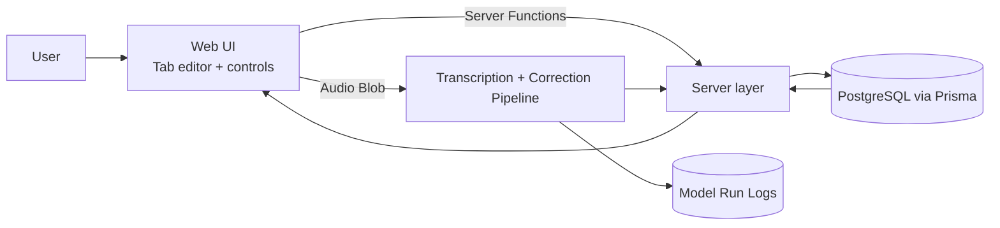
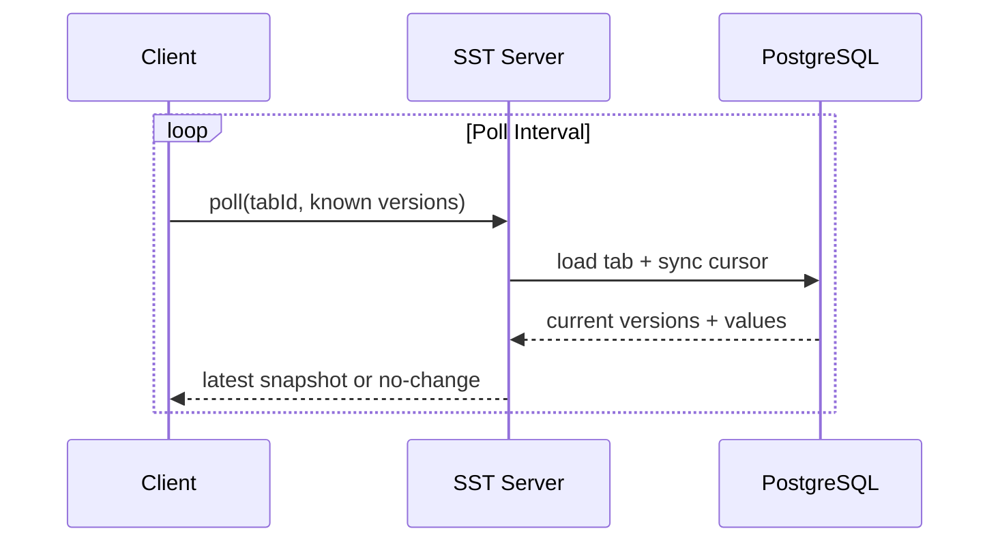
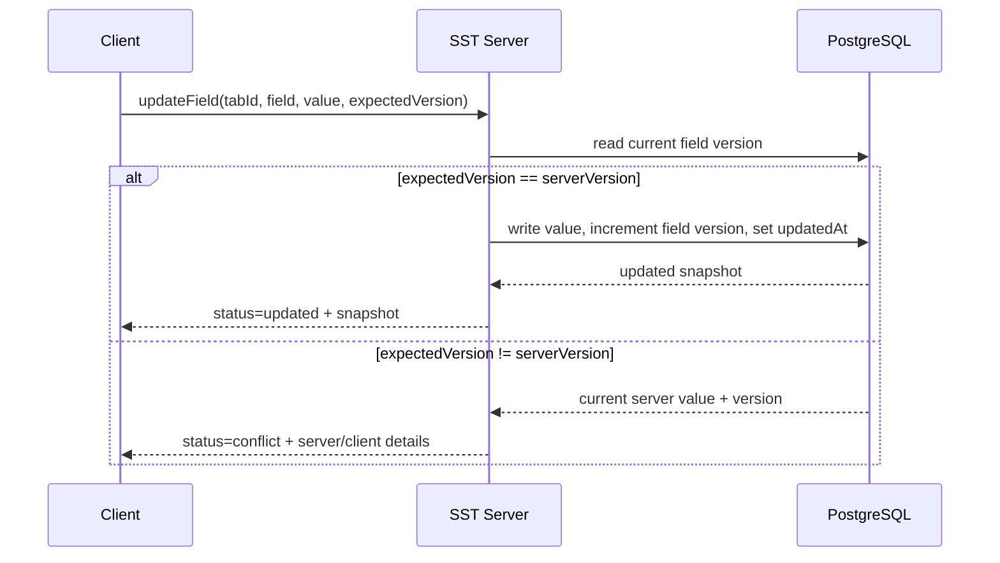
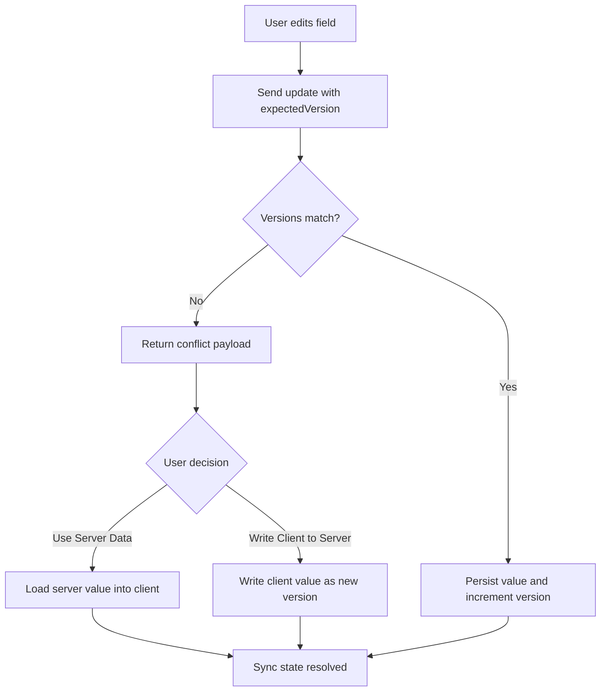
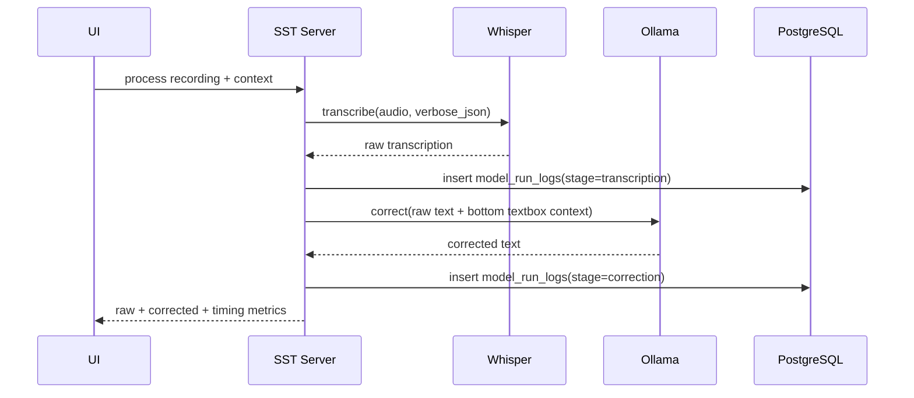
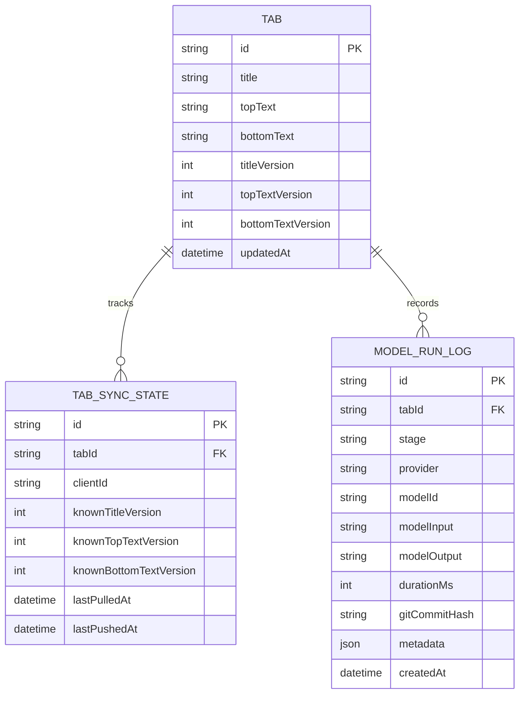

# SST v0

SST is a TanStack Start app for speech-to-text workflows with conflict-safe tab syncing and model-run telemetry.

The original `apps/sst-web` app remains untouched. `apps/sst` is the new v0 implementation with a server-backed architecture.

## Goals of v0

- Multiple tabs for parallel thought streams.
- Field-level conflict protection for tab title, top text, and bottom text.
- Polling-based multi-client synchronization.
- Local audio replay (not synchronized).
- Server-side transcription + correction pipeline.
- Persisted model-run telemetry for future quality/cost evaluation.

## Development

Run the app on port `3059`:

```bash
bun run dev --filter=@repo/sst
```

Run repository checks:

```bash
bun run ci
```

## Architecture Overview



## Tabs and Sync Logic

### Data that is synchronized

Each tab stores three independently versioned fields:

- `title`
- `topText`
- `bottomText`

Every field has:

- current value
- integer version (`...Version`)
- last update timestamp (`...UpdatedAt`)

This allows conflicts to be detected per field instead of per full tab document.

### Polling-based sync model

Each client periodically fetches the active tab state and updates its local cursor (`tab_sync_states`).

The active tab selection is persisted per client in local storage and restored on reload.



### Write path and conflict detection

Writes are optimistic: the client sends `expectedVersion` for the field it edits.



### Explicit conflict resolution actions

When conflict is returned, the UI must force an explicit choice:

- `Use Server Data`: overwrite local draft state with the latest server value.
- `Write Client to Server`: force-write local value as next server version.

No silent merges are performed in v0.



### Rendering mode

SST runs as a client-rendered app for v0. Route definitions use `ssr: false` to avoid SSR-related issues for this workflow.

For CSR-only routes, browser APIs (`window`, `localStorage`) are used directly in route runtime logic without SSR guards.

### Runtime error handling

Runtime exceptions are not silently swallowed in UI route logic.

- Unexpected client/runtime failures are forwarded to the TanStack route error boundary (`errorComponent`).
- Local fallback status messages are only used for expected domain results (`conflict`, `not_found`), not for unexpected exceptions.

## Model Eval Data Storage

### Why these logs exist

SST v0 stores structured run data so future evaluation can compare model quality, latency, and cost trade-offs without changing the product flow.

### Stored telemetry

Each model run record can include:

- stage (`transcription` or `correction`)
- provider (`whisper`, `ollama`, `unknown`)
- model id (for example `whisper-1`, `gemma3:latest`)
- model input
- model output
- duration in milliseconds
- current git commit hash
- optional metadata payload
- optional `tabId` relation

### Logging flow



### Persistence model



## Contracts (No-Code View)

The server/client boundary is defined by typed contracts in:

- `src/contracts/tab-sync.ts`

Main contract groups:

- tab lifecycle inputs (create, rename, update)
- conflict payloads (`updated`, `conflict`, `not_found`)
- sync cursor payloads for polling
- model-run log creation payloads

This ensures UI and server use the same values and payload shapes.

## Current Implementation Status

Implemented in this repository:

- TanStack Start app scaffold (`apps/sst`)
- Prisma schema + migration for tabs, sync states, and model-run logs
- Shared typed contracts for sync and telemetry payloads
- Tab server functions for create/select/rename/update and conflict handling
- Tabbed UI with per-client active-tab restore and conflict resolution actions

Planned next:

- Full polling runtime in UI
- Whisper + Ollama pipeline integration in server layer
- Debug diff UI and timing display

## Out of Scope for v0

- WebSocket/SSE real-time transport (polling only in v0)
- Automated evaluation dashboards
- Cross-client synchronization of raw audio files
